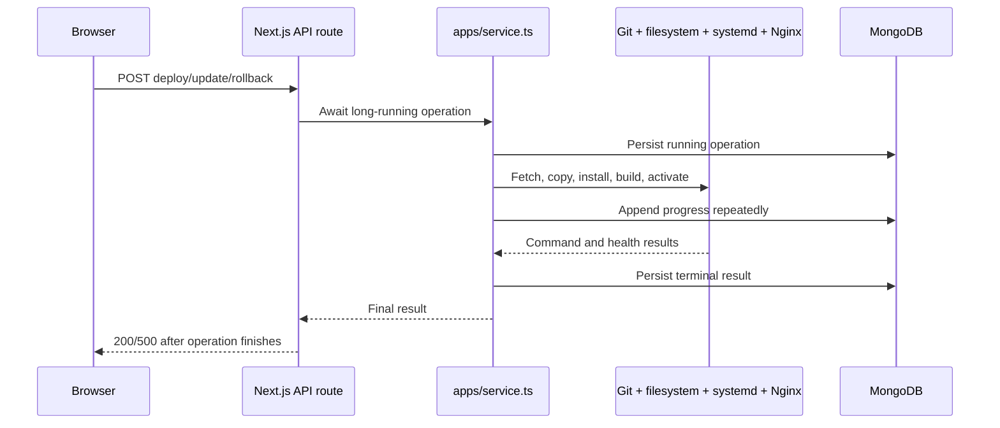
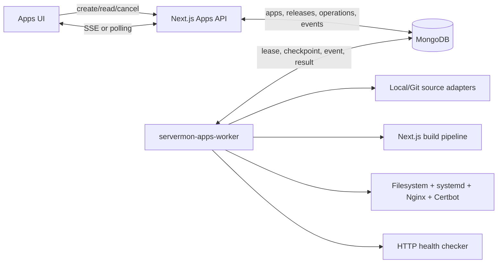
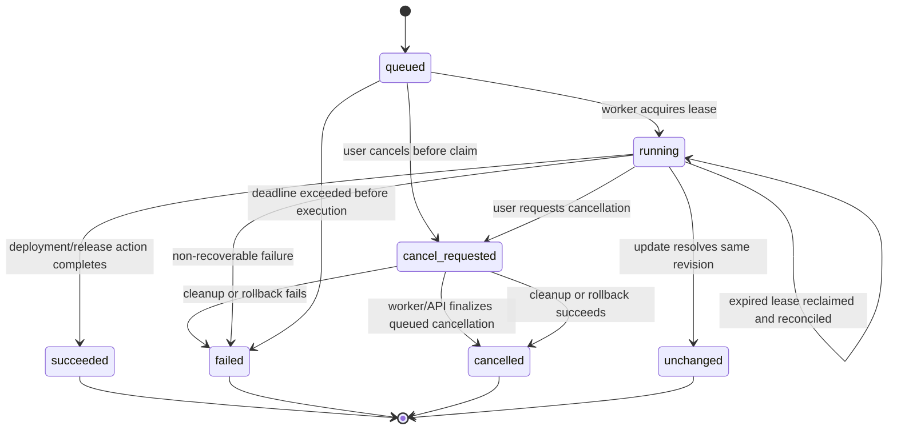
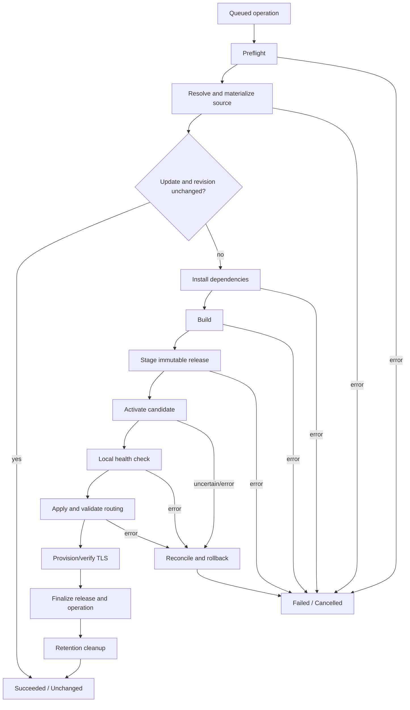

# Apps v2: Reliable Single-Host Deployments

**Status:** Proposed design
**Date:** 2026-07-31
**Audience:** ServerMon maintainers and implementation agents
**Primary objective:** Replace request-owned Apps deployments with a durable,
recoverable worker architecture without interrupting existing managed
applications.
**Implementation status:** Not started

---

## 1. Executive Summary

The current Apps module began as a synchronous Next.js deployment workflow and
has accumulated operation history, Git updates, automatic updates, rollback,
runtime inspection, log streaming, timeout handling, stale-operation recovery,
systemd management, Nginx management, and TLS provisioning. Those capabilities
are useful, but the execution model still ties long-running work to an HTTP
request.

Apps v2 will move all mutating app operations into a dedicated
`servermon-apps-worker` systemd service. The web application will validate a
request, create a durable operation in MongoDB, and return `202 Accepted`
immediately. The worker will claim operations with a renewable lease, execute
an explicit checkpointed pipeline, publish structured progress events, and
recover safely after worker crashes or host reboots.

The overhaul is deliberately limited:

- It targets one Linux server.
- It retains MongoDB, systemd, Nginx, Certbot, the current managed-app
  filesystem layout, and the existing ServerMon/app operating-system user
  model.
- It supports the existing Next.js template first.
- It does not add Docker, Compose, fleet deployment, or per-app Linux users.
- Existing applications keep running while the control plane is migrated.

The selected design uses MongoDB as the durable operation queue. No Redis,
RabbitMQ, or other infrastructure is introduced. The worker initially processes
one operation at a time, which makes shared systemd, Nginx, and Certbot
mutations deterministic. The schemas and boundaries allow controlled
concurrency to be added later without redesigning the operation contract.

---

## 2. Confirmed Product Decisions

These decisions were confirmed before writing this design:

| Decision                    | Selected behavior                                         |
| --------------------------- | --------------------------------------------------------- |
| Deployment target           | Reliable single-server deployments                        |
| Migration                   | In-place; existing apps must keep running                 |
| Execution process           | Separate `servermon-apps-worker` systemd service          |
| Durable queue               | MongoDB; no additional infrastructure                     |
| Initial template support    | Next.js only                                              |
| Crash recovery              | Resume from the last safe checkpoint after reconciliation |
| Application OS user         | Keep the current model unchanged                          |
| Per-app Linux users         | Deferred                                                  |
| Docker/Compose              | Deferred                                                  |
| Fleet/multi-host deployment | Deferred                                                  |

### 2.1 Explicitly deferred security change

Apps v2 will **not** create a Linux user per managed application. Managed apps
will continue to run using the same effective user behavior as the current
implementation. The new worker must not silently change ownership, service
users, sudoers rules, or application runtime identities.

This decision does not permit weaker handling elsewhere. Apps v2 must still:

- validate every ServerMon-generated filesystem path;
- avoid shell interpolation for ServerMon-generated commands;
- redact environment values and credentials from operation events;
- write environment files with restrictive permissions;
- require an authenticated administrator for every mutation;
- preserve an audit record of who requested each operation.

Per-app users and stronger systemd sandboxing remain a separate future design.

---

## 3. Current-State Assessment

### 3.1 Current request flow

The current mutation flow is:



The browser may poll operation state, but the server-side action is still owned
by the request that initiated it.

### 3.2 Current concentration of responsibilities

At the time of this design:

| File                               | Approximate size | Responsibilities currently mixed together                                                                                                          |
| ---------------------------------- | ---------------: | -------------------------------------------------------------------------------------------------------------------------------------------------- |
| `src/modules/apps/ui/AppsPage.tsx` |      1,639 lines | API loading, form state, mutations, polling, operation logs, cards, runtime details, release history, notices, dialogs                             |
| `src/lib/apps/service.ts`          |      1,250 lines | Validation, normalization, DTO mapping, CRUD, operation persistence, Git orchestration, deployment orchestration, rollback, delete, stale recovery |
| `src/lib/apps/deploy.ts`           |        557 lines | Command execution, release creation, source copy, env rendering, systemd, health checks, Nginx, Certbot, rollback                                  |
| `src/lib/apps/git.ts`              |        212 lines | Repository creation, fetch, checkout, revision resolution                                                                                          |
| `src/models/ManagedApp.ts`         |        159 lines | App configuration, releases, operations, auto-update state                                                                                         |

Large files are not automatically wrong, but these files contain multiple
independently changing concerns and make failure recovery difficult to reason
about.

### 3.3 Current failure mechanism

An operation is persisted as `running` before host work begins. If the web
process exits, the host reboots, or a command never returns before the terminal
write, MongoDB retains the `running` record. The timeout recovery added on
2026-07-30 prevents an update from remaining stuck forever, but it does not
change the ownership model:

- a request still waits for long-running host work;
- deploy, rollback, and delete do not share one durable job protocol;
- the application document still embeds bounded operation logs;
- safe restart behavior depends on operation-specific recovery code;
- local UI loading state and persisted operation state both influence controls.

### 3.4 Current architecture that must be preserved initially

Apps v2 must preserve these compatible contracts during migration:

- application root:
  `SERVERMON_APPS_ROOT/<slug>` or `/var/lib/servermon/apps/<slug>`;
- release root: `<app-root>/releases/<release-id>`;
- active release pointer: `<app-root>/current`;
- repository cache: `<app-root>/repository`;
- systemd unit name: `servermon-app-<slug>.service`;
- Nginx routing by configured domain and port;
- existing app commands: install, build, and start;
- existing local and HTTPS Git source types;
- existing managed applications remain runnable if ServerMon is stopped.

---

## 4. Goals

### 4.1 Reliability goals

1. The API request that starts an operation must finish without waiting for Git,
   install, build, systemd, Nginx, TLS, or health checks.
2. Restarting the ServerMon web service must not interrupt an Apps operation.
3. Restarting the Apps worker or rebooting the host must not leave an operation
   permanently locked.
4. Recovery must inspect both MongoDB checkpoints and actual host state before
   proceeding.
5. At most one active mutating operation may exist for a given app.
6. A terminal operation may never transition back to a non-terminal state.
7. A stale worker may never overwrite a result written by a newer worker lease.
8. The previous active release must remain available until the new release is
   healthy and finalization has completed.
9. Retrying an idempotent request must not create duplicate operations.
10. Every failure must identify the failed phase and retain useful, redacted
    evidence.

### 4.2 User experience goals

1. Clicking Deploy, Update, Rollback, or Delete must show a queued operation
   immediately.
2. Progress must survive browser refreshes and navigation.
3. A button must show one clear state: idle, queued, running, cancelling, or
   terminal. It must not display both the normal action icon and a second
   ambiguous spinner.
4. A worker-offline condition must be visible instead of looking like an
   endlessly queued job.
5. Operators must see:
   - the active phase;
   - elapsed time;
   - the last progress event;
   - whether cancellation is available;
   - the previous and candidate release;
   - actionable failure details;
   - retained logs.
6. SSE disconnects must degrade to polling without losing correctness.

### 4.3 Maintainability goals

1. Domain state transitions must be testable without MongoDB or host commands.
2. Persistence, orchestration, and infrastructure adapters must have explicit
   interfaces.
3. The deployment pipeline must be composed of named, independently tested
   steps.
4. Update must reuse the deployment pipeline instead of maintaining a second
   deployment implementation.
5. API routes must use shared authentication and error-response helpers.
6. The main Apps page must be decomposed into bounded components and hooks.

### 4.4 Operational goals

1. The worker must expose a durable heartbeat.
2. Operations must have correlation IDs across API, worker, event, and system
   logs.
3. Queue age, operation duration, phase duration, retries, cancellations,
   recovery, and rollback failures must be observable.
4. The deployment installer and release contract must verify that both the web
   and worker services are installed from the same ServerMon release.

---

## 5. Non-Goals

The following are outside this overhaul:

- Docker or Docker Compose runtimes;
- Python, static-site, or arbitrary multi-process templates;
- deployment to fleet agents or remote hosts;
- per-app Linux users;
- changing the privilege model of existing managed apps;
- Kubernetes-style scheduling;
- distributed queue infrastructure;
- parallel operations across multiple ServerMon hosts;
- blue/green traffic splitting;
- canary percentages;
- database migration orchestration for deployed applications;
- automatic application data backups;
- a public third-party deployment API;
- eliminating administrator-provided install/build/start commands;
- encrypting all historical environment values as part of this change;
- redesigning the general ServerMon Updates module.

These non-goals must not be introduced opportunistically by the implementation.

---

## 6. Architecture Options Considered

### 6.1 Option 1: Continue hardening synchronous API routes

Keep deployment execution inside the Next.js route and add more timeouts,
reconciliation, and operation-specific cleanup.

**Advantages**

- smallest short-term diff;
- no additional process;
- existing tests require fewer changes.

**Disadvantages**

- web restarts still interrupt work;
- request timeouts remain coupled to deployment duration;
- every new operation needs custom stale recovery;
- UI and backend state remain difficult to reconcile;
- reliability fixes continue accumulating inside `service.ts`.

**Decision:** Rejected. This treats individual failure symptoms without removing
request ownership.

### 6.2 Option 2: Durable queue with a worker inside the web process

Create durable MongoDB operations, but run the polling worker from
`src/server.ts`.

**Advantages**

- durable operation contract;
- no second systemd unit;
- simpler packaging.

**Disadvantages**

- ServerMon web deployments and restarts still kill active app work;
- a web-process memory or event-loop problem affects the worker;
- multiple web processes could accidentally start multiple workers;
- operational health of the API and worker cannot be managed independently.

**Decision:** Rejected. Better than synchronous routes, but it does not meet the
confirmed process-isolation requirement.

### 6.3 Option 3: MongoDB queue with a separate systemd worker

The API enqueues operations. A dedicated process leases and executes them.

**Advantages**

- web restarts do not interrupt operations;
- no new infrastructure beyond MongoDB;
- worker lifecycle and logs are independently observable;
- leases and checkpoints provide deterministic recovery;
- API contracts become fast and stable;
- existing host adapters can be migrated incrementally.

**Disadvantages**

- installer, release, and local-development workflows must manage a second
  process;
- queue leasing and fencing require careful implementation;
- schema migration and compatibility work are larger than a patch.

**Decision:** Selected.

---

## 7. Target Architecture

### 7.1 Component overview



### 7.2 Responsibility boundary

#### Web/API process

The web process may:

- authenticate and authorize;
- validate request bodies;
- resolve the managed app;
- enforce an idempotency key;
- create an operation;
- read apps, releases, operations, events, runtime snapshots, and worker health;
- request cancellation;
- stream persisted events.

The web process must not:

- run Git;
- copy application source;
- run install or build commands;
- change the `current` symlink;
- write systemd or Nginx configuration;
- run Certbot;
- restart application services;
- perform deployment health checks;
- mark a worker-owned operation successful.

#### Apps worker process

The worker owns:

- durable operation claiming;
- lease renewal and fencing;
- total and phase deadlines;
- source resolution;
- release materialization;
- install and build commands;
- candidate configuration rendering;
- activation and rollback;
- health checks;
- operation checkpointing;
- event persistence;
- cancellation;
- stale operation recovery;
- automatic Git-update scheduling;
- worker heartbeat.

#### MongoDB

MongoDB is the source of truth for:

- configured apps;
- immutable release metadata;
- operation state and checkpoints;
- ordered operation events;
- worker heartbeat;
- automatic-update scheduling state.

MongoDB is not the source of truth for whether a service is actually healthy or
which filesystem target is active. Recovery must reconcile persisted intent
with the host.

#### Host

The host remains the source of truth for:

- which release the `current` symlink points to;
- the content and state of the systemd unit;
- systemd service state;
- Nginx configuration validity;
- certificate availability;
- local health response.

### 7.3 Initial concurrency model

Apps v2 initially runs **one worker execution slot globally**.

Reasons:

- systemd daemon reloads affect shared host state;
- Nginx configuration testing and reload are global;
- Certbot has its own global lock;
- serial execution substantially simplifies recovery;
- reliability is the selected priority.

The data model still enforces one active operation per app. A future release may
parallelize source/build phases while keeping activation under a global host
mutation lock, but that is not part of this implementation.

---

## 8. Core Reliability Invariants

The implementation must preserve all invariants below.

### Invariant 1: One active mutation per app

MongoDB must reject a second active Deploy, Update, Rollback, or Delete
operation for the same app. A browser-side disabled button is not a lock.

### Invariant 2: One effective worker owner

Only the worker holding the current lease owner and lease generation may update
running checkpoints or write a terminal result.

### Invariant 3: Terminal states are immutable

`succeeded`, `failed`, `cancelled`, and `unchanged` are terminal. Every terminal
write must include a database predicate that the operation is active,
non-terminal, and owned by the expected lease generation.

### Invariant 4: Releases are immutable

After a release moves from its staging path to its final release directory, its
source, environment file, manifest, and build output must not be edited in
place. A configuration change creates another release.

### Invariant 5: Activation is reversible

Before activation, record the actual previous `current` target and relevant host
configuration. If activation or health verification fails, restore the prior
target and restart the prior service configuration.

### Invariant 6: Checkpoints describe completed facts

A step may be marked `succeeded` only after its side effects have completed and
the success checkpoint has been durably written. A step marked `running` is
treated as uncertain after a crash.

### Invariant 7: Recovery inspects reality

An uncertain activation step must not be blindly repeated. Recovery inspects:

- the current symlink target;
- candidate and prior release directories;
- systemd unit content and active state;
- Nginx configuration;
- local health.

It then continues, finalizes, or rolls back.

### Invariant 8: The previous release is retained

Cleanup must not remove the prior active release during the operation that
replaces it. Retention cleanup runs only after successful finalization and must
never delete the current or immediate rollback release.

### Invariant 9: Secrets do not enter operation events

Environment values, repository credentials, session cookies, tokens, and
private keys must not be stored in operation events or structured logs.

### Invariant 10: API completion does not imply operation completion

A successful enqueue response means the operation was accepted, not that the
app was deployed.

---

## 9. Domain Model

Apps v2 separates configuration, releases, operations, and events. It must not
continue growing embedded arrays inside `ManagedApp`.

### 9.1 ManagedApp

`ManagedApp` remains the desired configuration record.

Required additions:

```ts
interface ManagedAppV2Fields {
  configVersion: number;
  executionEngine: 'legacy' | 'v2';
  activeReleaseId?: string;
  deletingAt?: Date;
  deletedAt?: Date;
  migrationVersion?: number;
}
```

Rules:

- `configVersion` increments on every deployment-affecting edit.
- `executionEngine` permits per-app rollout and rollback.
- `activeReleaseId` eventually replaces `currentReleaseId`; during migration,
  both fields are kept consistent.
- apps are soft-deleted first; destructive host cleanup is worker-owned.
- existing embedded `releases` and `operations` remain temporarily for rollback
  compatibility but are deprecated.
- new v2 code reads release and operation history from their own collections.

Deployment-affecting fields include:

- source type/path/URL/branch;
- domain;
- port;
- install/build/start commands;
- environment variables;
- health path;
- TLS setting;
- template.

For the first implementation, every accepted app PATCH increments
`configVersion`, including name-only changes. This conservative rule can be
relaxed later only after fields are explicitly classified as deployment-neutral.

### 9.2 AppOperation

Create `src/models/AppOperation.ts`.

Conceptual schema:

```ts
type AppOperationType = 'deploy' | 'update' | 'rollback' | 'delete';

type AppOperationStatus =
  | 'queued'
  | 'running'
  | 'cancel_requested'
  | 'succeeded'
  | 'failed'
  | 'cancelled'
  | 'unchanged';

type AppOperationPhase =
  | 'queued'
  | 'preflight'
  | 'source'
  | 'install'
  | 'build'
  | 'stage'
  | 'activate'
  | 'health'
  | 'routing'
  | 'tls'
  | 'finalize'
  | 'cleanup'
  | 'rollback'
  | 'complete';

interface AppOperationRecord {
  operationId: string;
  appId: ObjectId;
  appSlug: string;
  type: AppOperationType;
  status: AppOperationStatus;
  phase: AppOperationPhase;
  active: boolean;

  requestedBy: {
    userId: string;
    role: 'admin';
  };
  requestId: string;
  idempotencyKey?: string;

  input: {
    configVersion: number;
    force?: boolean;
    requestedRevision?: string;
    targetReleaseId?: string;
  };

  snapshot: {
    name: string;
    slug: string;
    templateId: 'nextjs';
    sourceType: 'local' | 'git';
    sourcePath?: string;
    gitUrl?: string;
    gitBranch?: string;
    domain: string;
    port: number;
    commands: {
      install: string;
      build: string;
      start: string;
    };
    healthCheckPath: string;
    tlsEnabled: boolean;
    envVersion: string;
  };

  previousReleaseId?: string;
  candidateReleaseId?: string;
  resolvedRevision?: string;

  lease?: {
    ownerId: string;
    generation: number;
    acquiredAt: Date;
    heartbeatAt: Date;
    expiresAt: Date;
  };

  attempt: number;
  nextAttemptAt?: Date;
  startedAt?: Date;
  deadlineAt: Date;
  cancelRequestedAt?: Date;
  completedAt?: Date;

  steps: AppOperationStep[];

  result?: {
    releaseId?: string;
    revision?: string;
    warnings: OperationWarning[];
    rollbackPerformed?: boolean;
  };

  error?: {
    code: AppOperationErrorCode;
    message: string;
    phase: AppOperationPhase;
    retryable: boolean;
    causeSummary?: string;
    rollbackError?: string;
  };

  nextEventSequence: number;
  createdAt: Date;
  updatedAt: Date;
}
```

Environment values must not be copied into the operation snapshot. `envVersion`
is a stable digest or version identifier used to detect which desired
configuration the operation captured. The worker reads the app's environment
values only after confirming the captured `configVersion`. The release manifest
records `envVersion`, never secret values.

### 9.3 Operation steps

```ts
type AppOperationStepStatus = 'pending' | 'running' | 'succeeded' | 'failed' | 'skipped';

interface AppOperationStep {
  key: string;
  phase: AppOperationPhase;
  status: AppOperationStepStatus;
  attempt: number;
  startedAt?: Date;
  completedAt?: Date;
  checkpoint?: Record<string, string | number | boolean | null>;
  errorCode?: AppOperationErrorCode;
}
```

Checkpoints must contain identifiers and paths, not large logs or secret values.
Examples:

- resolved commit SHA;
- staging directory;
- candidate release ID;
- previous symlink target;
- candidate unit content hash;
- candidate Nginx content hash;
- health-check timestamp and status;
- final active release ID.

### 9.4 Required AppOperation indexes

```js
{
  operationId: 1;
} // unique
```

```js
{ appId: 1, active: 1 } // unique where active === true
```

The second index must be a partial unique index:

```js
{
  unique: true,
  partialFilterExpression: { active: true }
}
```

This is the authoritative per-app mutation lock.

Additional indexes:

```js
{ status: 1, nextAttemptAt: 1, createdAt: 1 }
{ 'lease.expiresAt': 1, active: 1 }
{ appId: 1, createdAt: -1 }
{ idempotencyKey: 1, appId: 1 } // unique when idempotencyKey exists
```

### 9.5 AppRelease

Create `src/models/AppRelease.ts`.

```ts
type AppReleaseStatus = 'staging' | 'ready' | 'active' | 'superseded' | 'failed';

interface AppReleaseRecord {
  releaseId: string;
  appId: ObjectId;
  appSlug: string;
  operationId: string;
  status: AppReleaseStatus;

  source: {
    type: 'local' | 'git';
    revision?: string;
    repositoryUrl?: string;
    branch?: string;
    contentDigest?: string;
  };

  config: {
    configVersion: number;
    envVersion: string;
    domain: string;
    port: number;
    commandsDigest: string;
    healthCheckPath: string;
    tlsEnabled: boolean;
  };

  paths: {
    releaseRoot: string;
    sourceRoot: string;
    envFile: string;
    manifestFile: string;
  };

  build: {
    startedAt?: Date;
    completedAt?: Date;
    durationMs?: number;
  };

  activation?: {
    activatedAt?: Date;
    supersededAt?: Date;
    healthCheckedAt?: Date;
  };

  warnings: OperationWarning[];
  error?: {
    code: AppOperationErrorCode;
    message: string;
  };

  createdAt: Date;
  updatedAt: Date;
}
```

Indexes:

```js
{ releaseId: 1 } // unique
{ appId: 1, createdAt: -1 }
{ appId: 1, status: 1 }
```

Only one release may be logically active for an app. The filesystem symlink
remains the final authority during recovery.

### 9.6 AppOperationEvent

Create `src/models/AppOperationEvent.ts`.

```ts
type OperationEventKind =
  | 'state'
  | 'phase'
  | 'command'
  | 'log'
  | 'warning'
  | 'error'
  | 'recovery'
  | 'heartbeat';

interface AppOperationEventRecord {
  operationId: string;
  sequence: number;
  timestamp: Date;
  kind: OperationEventKind;
  level: 'debug' | 'info' | 'warn' | 'error';
  phase: AppOperationPhase;
  message: string;
  details?: Record<string, string | number | boolean | null>;
}
```

Indexes:

```js
{ operationId: 1, sequence: 1 } // unique
{ timestamp: 1 } // TTL: 90 days in the initial implementation
```

Event sequence allocation must be atomic. The operation record contains
`nextEventSequence`; the event repository increments it with
`findOneAndUpdate`, uses the returned value for the event, and never derives a
sequence from event count. Worker-generated event allocation must also verify
the current lease identity.

Recommended retention:

- keep terminal operation summaries indefinitely or according to the existing
  application-history policy;
- keep verbose events for 90 days by default;
- retain failure events longer if storage permits;
- make retention configurable later, not required for first cutover.

### 9.7 AppsWorkerHeartbeat

Create `src/models/AppsWorkerHeartbeat.ts`.

```ts
interface AppsWorkerHeartbeatRecord {
  workerId: string;
  hostname: string;
  pid: number;
  version: string;
  startedAt: Date;
  heartbeatAt: Date;
  status: 'starting' | 'idle' | 'running' | 'draining' | 'stopped';
  activeOperationId?: string;
}
```

The UI treats the worker as offline when no heartbeat has been observed for more
than three heartbeat intervals.

---

## 10. Operation State Machine

### 10.1 State diagram



### 10.2 Transition rules

| From               | To                 | Allowed writer       | Required condition                     |
| ------------------ | ------------------ | -------------------- | -------------------------------------- |
| none               | `queued`           | API                  | unique active-app index permits insert |
| `queued`           | `running`          | worker               | atomic claim succeeds                  |
| `queued`           | `cancel_requested` | API                  | operation is active                    |
| `running`          | `cancel_requested` | API                  | operation is active                    |
| `running`          | terminal           | worker               | matching lease owner and generation    |
| `cancel_requested` | terminal           | worker               | matching lease owner and generation    |
| `queued`           | `cancelled`        | cancellation service | no worker lease exists                 |
| any terminal       | anything           | nobody               | forbidden                              |

`active` becomes `false` in the same atomic update that writes the terminal
status.

### 10.3 Why `active` is separate from `status`

The partial unique index must express the lock with a simple predicate. Using
`active: true` avoids relying on a partial index with multiple status values and
makes terminal release of the lock explicit.

Code must never set `active: false` before writing the final result. Otherwise a
second operation could begin while cleanup or rollback is still running.

---

## 11. Queue, Lease, and Fencing Protocol

### 11.1 Worker identity

At startup, the worker creates:

```text
<hostname>:<pid>:<random-instance-id>
```

The value is unique per process lifetime and is stored in heartbeat and lease
records.

### 11.2 Filesystem singleton lock

Because Apps v2 targets one host, the worker must also hold a non-blocking
filesystem lock such as:

```text
/run/servermon/apps-worker.lock
```

If the lock is already held, the second worker exits with a clear error. The
Mongo lease remains necessary for crash recovery and stale-writer fencing.

The lock path must be configurable for tests. Do not use a home directory.

### 11.3 Claim algorithm

Every poll:

1. Find the oldest operation where:
   - `active` is true;
   - status is `queued`; or
   - status is `running`/`cancel_requested` with an expired lease;
   - `nextAttemptAt` is absent or due;
   - `deadlineAt` has not passed.
2. Atomically:
   - set status to `running` if it was queued;
   - set the lease owner;
   - increment lease generation;
   - set acquired, heartbeat, and expiry timestamps;
   - increment `attempt`;
   - set `startedAt` if absent.
3. Return the claimed document.
4. Emit a claimed or recovery event.
5. Execute reconciliation before selecting the next pipeline step.

The claim must be one `findOneAndUpdate`; a read followed by an update is not
safe.

### 11.4 Lease timings

Recommended initial constants:

| Setting                          |      Value |
| -------------------------------- | ---------: |
| Queue poll interval              |   1 second |
| Worker heartbeat interval        |  5 seconds |
| Operation lease heartbeat        |  5 seconds |
| Operation lease duration         | 30 seconds |
| Worker-offline threshold         | 20 seconds |
| Graceful shutdown drain          | 30 seconds |
| Default total operation deadline | 60 minutes |

Constants belong in one configuration module and are validated at startup.

### 11.5 Lease renewal

Lease renewal must match:

```text
operationId + active=true + lease.ownerId + lease.generation
```

If renewal modifies zero records:

1. abort the current command tree;
2. stop writing events;
3. do not write a terminal result;
4. log a lease-loss error locally;
5. let the current database owner recover.

### 11.6 Fenced writes

Every worker-owned mutation after claim must match the current lease owner and
generation. This includes:

- step start;
- step completion;
- checkpoint writes;
- candidate release assignment;
- event sequence allocation;
- terminal result;
- cancellation finalization.

Infrastructure side effects cannot be fenced by MongoDB alone. The single
filesystem worker lock prevents two local workers from mutating the host
concurrently. Database fencing prevents late asynchronous callbacks from
changing durable state.

### 11.7 Deadline handling

The operation-level `AbortController` is aborted when:

- total deadline is reached;
- cancellation is requested and the current step is cancellable;
- lease is lost;
- the worker begins forced shutdown.

All child commands must terminate their process group, not just reject the
JavaScript promise.

After an abort:

- if activation has not begun, remove staging artifacts and finish failed or
  cancelled;
- if activation may have begun, run reconciliation and rollback without using
  the already-aborted signal;
- keep the operation active until cleanup/rollback finishes;
- then write exactly one terminal result.

---

## 12. Idempotency and Duplicate Requests

### 12.1 Client contract

Mutation requests accept:

```http
Idempotency-Key: <opaque client-generated value>
```

The browser creates a key once per user action and retains it until the enqueue
request receives a definitive response.

### 12.2 Server behavior

For the same app and idempotency key:

- if an operation already exists, return that operation;
- do not create another operation;
- use the original HTTP semantic result (`202` for active, `200` for terminal).

If another active operation exists under a different key, return:

```json
{
  "error": {
    "code": "APP_OPERATION_CONFLICT",
    "message": "Another operation is already active for this app.",
    "retryable": true,
    "details": {
      "operationId": "op_..."
    }
  },
  "requestId": "req_..."
}
```

The API should obtain the winning active operation after a duplicate-key error
and include its identifier.

### 12.3 Operation identifiers

Use Node's `crypto.randomUUID()` with an `op_` prefix. Do not add an identifier
dependency:

```text
op_<uuid-without-braces>
```

Release IDs should remain readable while including enough entropy to prevent
same-millisecond collisions:

```text
YYYYMMDD-HHMMSS-<short-revision-or-local>-<operation-suffix>
```

---

## 13. Configuration Snapshot Semantics

### 13.1 Why a snapshot is required

An operation may stay queued while an administrator edits the app. It must not
silently combine an old request with new commands or a new port.

At enqueue:

1. read the app;
2. copy all non-secret deployment fields into the operation snapshot;
3. record `configVersion`;
4. record `envVersion`;
5. create the operation.

### 13.2 Environment values

Do not copy environment values into `AppOperation`.

Recommended first implementation:

- keep environment values in `ManagedApp` as today;
- calculate `envVersion` from a canonical keyed digest;
- when the worker starts preflight, require the app's current
  `configVersion/envVersion` to match the operation;
- if they differ before execution, fail with `APP_CONFIG_CHANGED`;
- after preflight begins, use an in-memory copy and write it only to the staged
  release environment file;
- never emit values.

A later secret-store design may snapshot an encrypted environment revision.
That is outside this overhaul.

### 13.3 Editing during an active operation

Deployment-affecting PATCH requests must return `409 APP_OPERATION_CONFLICT`
while an operation is active. This avoids ambiguity and secret snapshot
problems.

Non-deployment metadata edits may be allowed later. Initially, block the entire
edit form while an operation is active for simplicity and correctness.

---

## 14. Unified Deployment Pipeline

Deploy and Update must use one deployment pipeline. Update adds source-change
resolution and may terminate as `unchanged`; it does not maintain a second copy
of activation logic.

### 14.1 Pipeline overview



### 14.2 Step 1: Preflight

Validate before expensive work:

- operation still owns the active app lock;
- app exists and is not deleted;
- operation snapshot matches the captured config version;
- template is `nextjs`;
- source configuration is valid;
- app root resolves inside `SERVERMON_APPS_ROOT`;
- release and workspace paths resolve inside the app root;
- configured domain and port remain valid;
- port is not assigned to another managed app;
- domain is not assigned to another managed app;
- required executables exist;
- app root is writable;
- systemd and Nginx control commands are available;
- sufficient free disk space is available using a conservative threshold;
- target rollback release exists for rollback operations.

Preflight must not alter active routing or service state.

### 14.3 Step 2: Resolve and materialize source

#### Git source

1. Ensure the repository cache exists.
2. Fetch the configured remote and branch with a phase timeout.
3. Resolve the exact remote commit SHA.
4. Persist the SHA as `resolvedRevision`.
5. For Update:
   - compare the SHA with the active release's source revision;
   - if equal, finish `unchanged`;
   - do not run install/build.
6. Materialize the exact SHA into an operation-specific workspace.
7. Never build directly in the shared repository cache.

The remote URL may contain credentials. Sanitized events may log the host and
repository path but must remove user info, tokens, and query parameters.

#### Local source

1. Resolve and validate the configured path.
2. Copy through the existing exclusion policy into an operation-specific
   workspace.
3. Calculate a content digest after the copy.
4. Persist the digest as the local source revision.

The local source may change while copying. Apps v2 does not add filesystem
snapshot technology. The copied workspace becomes the immutable source for that
operation once materialization completes.

### 14.4 Step 3: Install

- run the snapshotted install command in the operation workspace;
- preserve the current administrator-controlled shell-command feature;
- set an explicit phase timeout;
- stream redacted output in bounded chunks;
- capture the exit code and duration;
- abort the entire process group on timeout, cancellation, lease loss, or
  shutdown.

Do not log the entire process environment.

### 14.5 Step 4: Build

- run the snapshotted build command;
- use the same command-runner contract as Install;
- set an explicit phase timeout;
- ensure output stays within operation event limits;
- verify the workspace still exists afterward;
- optionally validate expected Next.js output without rejecting currently
  supported custom start commands.

Install and Build are safe to restart only after deleting the uncertain
workspace and rematerializing the source. Do not resume halfway through an npm
or pnpm command.

### 14.6 Step 5: Stage immutable release

Build under:

```text
<app-root>/staging/<operation-id>/
```

Produce:

```text
source/
env
deploy.json
```

Requirements:

- write `env` with mode `0600`;
- include no secret values in `deploy.json`;
- include manifest version, operation ID, release ID, source revision,
  `configVersion`, `envVersion`, domain, port, command digest, and timestamps;
- fsync or otherwise ensure critical files are closed before rename;
- rename the completed staging directory atomically into:
  `<app-root>/releases/<release-id>`;
- never modify the final directory after rename.

If finalization finds that the exact candidate release already exists and its
manifest matches the operation, treat the stage step as succeeded. If it exists
with different content, fail with `RELEASE_ID_CONFLICT`.

### 14.7 Step 6: Prepare activation

Before changing the host:

- read and persist the actual current symlink target;
- hash or back up the current systemd unit;
- hash or back up the current Nginx available-site configuration;
- record whether the Nginx enabled-site link exists;
- render candidate systemd and Nginx files into the operation workspace;
- validate generated paths and content;
- record the candidate hashes.

These checkpoints are required for recovery and rollback.

### 14.8 Step 7: Activate candidate release

Activation order:

1. Atomically install the candidate systemd unit.
2. Run `systemctl daemon-reload`.
3. Create a temporary `current` symlink pointing to the candidate release.
4. Atomically rename the temporary link over `current`.
5. Enable the app service if necessary.
6. Restart the app service.
7. Persist an `activation_attempted` checkpoint.

All ServerMon-generated systemd calls must use an argument-based process
runner instead of interpolated shell commands:

```ts
runCommand('systemctl', ['restart', serviceName], options);
```

Administrator-provided start/install/build commands remain shell commands by
explicit product decision.

### 14.9 Step 8: Local health check

- check `http://127.0.0.1:<port><healthPath>`;
- use bounded attempts with an overall phase deadline;
- record status codes and short error summaries;
- do not persist response bodies by default;
- treat cancellation as an instruction to reconcile and roll back;
- on failure, enter rollback.

### 14.10 Step 9: Routing

1. Atomically write the candidate Nginx available-site file.
2. Ensure the enabled-site symlink exists.
3. Run `nginx -t`.
4. If validation fails:
   - restore the prior file/link state;
   - run `nginx -t` again to verify restoration;
   - enter release rollback.
5. Reload Nginx.
6. Record candidate config hash and reload completion.

Nginx changes are host-global and justify the initial single-operation worker.

### 14.11 Step 10: TLS

TLS is a post-health, post-routing phase.

Behavior:

- if TLS is disabled, mark skipped;
- if a valid certificate already exists, render/verify TLS routing and skip
  Certbot issuance;
- otherwise invoke Certbot with its current bounded lock-retry behavior;
- re-run `nginx -t` before reload.

TLS issuance depends on external DNS and Let's Encrypt. A TLS failure after a
healthy HTTP deployment should not automatically destroy a healthy new
release. Apps v2 records:

- operation status: `succeeded`;
- result warning: `TLS_PROVISIONING_FAILED`;
- app/release remains active over the last valid routing configuration;
- UI presents an explicit warning and retry guidance.

If applying TLS configuration corrupts Nginx validation, restore the previous
valid Nginx configuration before recording the warning.

This differs intentionally from treating every Certbot error as a complete
application deployment failure.

### 14.12 Step 11: Finalize

Finalization:

1. Re-read the current symlink and confirm it points to the candidate.
2. Confirm systemd reports the expected service active.
3. Confirm local health once more.
4. Mark the previous release `superseded`.
5. Mark the candidate release `active`.
6. Update `ManagedApp.activeReleaseId` and compatibility
   `currentReleaseId`.
7. Persist Git current/last-checked/last-updated fields as appropriate.
8. Write the terminal operation result with a fenced atomic update.
9. Set `active: false` in the terminal update.

If the database terminal write fails transiently, retry it while retaining the
lease. If the worker dies after host activation but before finalization, the
next worker recovers by inspecting the host and may finalize the operation
without redeploying.

### 14.13 Step 12: Retention cleanup

Retention runs after the operation is terminal and must not affect its result.

Never delete:

- the current symlink target;
- the newly active release;
- the immediately previous successful release;
- a release targeted by an active rollback;
- a release referenced by an active operation.

Cleanup failures create warning events but do not turn a successful deployment
into a failure.

---

## 15. Recovery Algorithm

Recovery begins whenever a worker claims an expired `running` or
`cancel_requested` operation.

### 15.1 General recovery

1. Acquire a new lease generation.
2. Emit `Recovering operation after worker interruption`.
3. Load operation steps and checkpoints.
4. Inspect app, release records, filesystem, current symlink, systemd, Nginx,
   and health as required by the last uncertain phase.
5. Select one action:
   - resume from the next safe step;
   - rebuild an uncertain pre-activation step from a clean workspace;
   - finalize an already healthy activation;
   - roll back an unhealthy/uncertain activation;
   - fail because required state is irrecoverably inconsistent.

### 15.2 Recovery before activation

If the last uncertain phase is source, install, build, or stage:

- remove the operation staging/workspace directory;
- retain any immutable final release only if its manifest matches;
- reset affected steps to pending with an incremented attempt;
- restart from source materialization or the earliest required safe step.

### 15.3 Recovery during activation

Inspect:

- previous release checkpoint;
- candidate release existence and manifest;
- current symlink target;
- systemd unit hash;
- systemd active state;
- local health.

Cases:

| Observed state                                         | Recovery action                               |
| ------------------------------------------------------ | --------------------------------------------- |
| Current points to previous release and it is healthy   | Resume candidate activation                   |
| Current points to candidate and candidate is healthy   | Continue routing/finalization                 |
| Current points to candidate and candidate is unhealthy | Roll back                                     |
| Current points elsewhere                               | Fail with `HOST_STATE_DIVERGED`; do not guess |
| Candidate directory missing                            | Roll back/fail                                |
| Previous release missing but candidate healthy         | Finalize candidate with warning               |
| Neither candidate nor previous release is healthy      | Fail and surface manual recovery instructions |

### 15.4 Recovery after routing

Validate current Nginx state:

- `nginx -t`;
- expected domain config hash;
- enabled link;
- current release health.

If the candidate is healthy and routing is valid, continue TLS/finalization. If
routing is invalid, restore the prior config and roll back the release.

### 15.5 Maximum automatic attempts

Recommended behavior:

- queued claim: unlimited until deadline;
- worker-interruption recovery: maximum 3 worker attempts;
- deterministic command failure: no automatic same-operation retry;
- transient Mongo write: bounded exponential backoff;
- Certbot lock: retain current bounded retries;
- health checks: bounded attempts within the health phase;
- after maximum recovery attempts, fail with
  `OPERATION_RECOVERY_EXHAUSTED`.

An administrator may create a new operation after failure. Do not mutate a
terminal operation into a retry.

---

## 16. Rollback Pipeline

Rollback is a first-class worker operation, not a special synchronous route.

### 16.1 Rollback steps

1. Validate target release belongs to the app.
2. Verify release directory and manifest.
3. Record actual current target.
4. Verify target environment/source files.
5. Atomically repoint `current`.
6. Restart service.
7. Run local health check.
8. Verify routing still targets the configured port/domain.
9. Mark target active and prior active release superseded.
10. Finalize operation.

### 16.2 Rollback failure

If the target fails health:

- restore the release that was active when rollback began;
- restart it;
- verify health;
- finish the rollback operation as failed;
- keep the originally active release marked active.

If restoration also fails:

- finish failed with `ROLLBACK_RESTORE_FAILED`;
- retain both failure contexts;
- set app runtime status from actual inspection, not an assumed value;
- show manual recovery commands/paths without executing destructive cleanup.

---

## 17. Delete Pipeline

Delete must use the same durable operation contract because it changes
filesystem, systemd, and Nginx state.

### 17.1 API behavior

- set `deletingAt`;
- enqueue Delete;
- hide the app from default create/deploy actions;
- keep enough metadata for operation history and recovery.

### 17.2 Worker behavior

1. Stop and disable app service.
2. Remove the systemd unit.
3. Run daemon reload.
4. Remove Nginx enabled and available configuration.
5. Run `nginx -t`.
6. Reload Nginx.
7. Remove managed app root only after external configuration is valid.
8. Set `deletedAt`.
9. Finish operation.

If host cleanup fails, retain the app tombstone and operation so cleanup can be
retried. Do not delete the database record first.

Delete history retention may be handled by a later cleanup policy.

---

## 18. Automatic Git Updates

The Apps auto-update scheduler moves from the web process into the Apps worker.

### 18.1 Scheduler behavior

1. Worker heartbeat starts.
2. Scheduler queries Git apps whose `nextRunAt` is due.
3. For each due app without an active operation, enqueue an Update operation
   through the same application service used by the API.
4. Use a deterministic idempotency key:

```text
auto-update:<app-id>:<scheduled-window>
```

5. Update `nextRunAt` only after enqueue is accepted or an explicit active
   conflict is observed.
6. The Update pipeline resolves the remote SHA and may end `unchanged`.

The scheduler must not call the deployment pipeline directly.

### 18.2 Startup behavior

The worker's first queue scan naturally reclaims expired operations. Separate
operation-specific stale reconciliation in `src/server.ts` becomes unnecessary
after all apps are on v2.

During migration, legacy reconciliation remains enabled for legacy-engine apps.

---

## 19. Cancellation

### 19.1 API semantics

```http
POST /api/modules/apps/operations/<operation-id>/cancel
```

The endpoint:

- requires admin;
- is idempotent;
- sets `cancelRequestedAt`;
- transitions queued/running to `cancel_requested`;
- returns current operation state.

### 19.2 Worker semantics

The worker checks cancellation:

- before every step;
- while waiting between health checks;
- through the operation abort signal;
- after every child command exits;
- before activation.

### 19.3 Cancellation by phase

| Phase                      | Behavior                                                                                                    |
| -------------------------- | ----------------------------------------------------------------------------------------------------------- |
| queued                     | finish cancelled immediately                                                                                |
| source/install/build/stage | abort command, remove staging, finish cancelled                                                             |
| activate/health/routing    | reconcile, restore previous release/config, finish cancelled                                                |
| tls                        | abort if safe; keep healthy active release and finish cancelled with warning if issuance state is uncertain |
| finalize                   | cancellation may be too late; finalize success and report that cancellation was not applied                 |

The API must not promise cancellation succeeded merely because the request was
accepted.

---

## 20. Error Taxonomy

Create a typed error code union. At minimum:

```ts
type AppOperationErrorCode =
  | 'APP_NOT_FOUND'
  | 'APP_DELETED'
  | 'APP_CONFIG_CHANGED'
  | 'APP_OPERATION_CONFLICT'
  | 'APP_WORKER_OFFLINE'
  | 'OPERATION_DEADLINE_EXCEEDED'
  | 'OPERATION_CANCELLED'
  | 'OPERATION_LEASE_LOST'
  | 'OPERATION_RECOVERY_EXHAUSTED'
  | 'HOST_STATE_DIVERGED'
  | 'PREFLIGHT_FAILED'
  | 'INSUFFICIENT_DISK_SPACE'
  | 'SOURCE_PATH_INVALID'
  | 'GIT_AUTH_FAILED'
  | 'GIT_FETCH_FAILED'
  | 'GIT_REVISION_NOT_FOUND'
  | 'SOURCE_MATERIALIZATION_FAILED'
  | 'INSTALL_FAILED'
  | 'BUILD_FAILED'
  | 'RELEASE_ID_CONFLICT'
  | 'RELEASE_STAGE_FAILED'
  | 'SYSTEMD_UNIT_FAILED'
  | 'SERVICE_RESTART_FAILED'
  | 'HEALTH_CHECK_FAILED'
  | 'NGINX_CONFIG_FAILED'
  | 'NGINX_RELOAD_FAILED'
  | 'TLS_PROVISIONING_FAILED'
  | 'ROLLBACK_FAILED'
  | 'ROLLBACK_RESTORE_FAILED'
  | 'DELETE_FAILED'
  | 'INTERNAL_ERROR';
```

Every operation error includes:

- stable code;
- human-readable message;
- phase;
- retryable flag;
- redacted cause summary;
- rollback error when applicable.

Raw stack traces remain in server/worker logs and are not returned to the UI.

---

## 21. API Design

### 21.1 Shared response conventions

All new endpoints use:

```json
{
  "data": {},
  "requestId": "req_..."
}
```

Errors use:

```json
{
  "error": {
    "code": "BUILD_FAILED",
    "message": "The build command exited with status 1.",
    "retryable": false,
    "details": {}
  },
  "requestId": "req_..."
}
```

Compatibility routes retain their existing action-specific top-level keys while
internally using the new application service. Their nested payload changes from
a terminal deployment result to an accepted operation summary.

### 21.2 Create operation

```http
POST /api/modules/apps/<app-id>/operations
Content-Type: application/json
Idempotency-Key: <key>
```

Deploy:

```json
{
  "type": "deploy",
  "force": true
}
```

Update:

```json
{
  "type": "update"
}
```

Rollback:

```json
{
  "type": "rollback",
  "targetReleaseId": "..."
}
```

Delete:

```json
{
  "type": "delete"
}
```

Response:

```http
HTTP/1.1 202 Accepted
Location: /api/modules/apps/operations/op_...
```

```json
{
  "data": {
    "operation": {
      "id": "op_...",
      "appId": "...",
      "type": "update",
      "status": "queued",
      "phase": "queued",
      "createdAt": "..."
    },
    "links": {
      "self": "/api/modules/apps/operations/op_...",
      "events": "/api/modules/apps/operations/op_.../events",
      "cancel": "/api/modules/apps/operations/op_.../cancel"
    }
  },
  "requestId": "req_..."
}
```

### 21.3 Operation detail

```http
GET /api/modules/apps/operations/<operation-id>
```

Returns summary, steps, result/error, timing, and worker/lease freshness. It does
not return unbounded events.

### 21.4 Operation events

```http
GET /api/modules/apps/operations/<operation-id>/events
Accept: text/event-stream
Last-Event-ID: <sequence>
```

SSE behavior:

- authenticate before opening stream;
- query events with sequence greater than the last delivered ID;
- use sequence as SSE `id`;
- send structured event JSON;
- send a comment heartbeat every 15 seconds;
- close after terminal state and all events are delivered;
- bound each connection lifetime if necessary and allow reconnect;
- honor `Last-Event-ID`.

MongoDB Change Streams must not be required because standalone MongoDB
deployments may not support them. The server polls for new events once per
second while an SSE connection is open.

### 21.5 App listing

`GET /api/modules/apps` should return:

- app configuration summary;
- active release summary;
- active operation summary;
- cached or best-effort runtime summary;
- worker availability summary once per response, not repeated per app.

Do not embed all operation logs or all release logs in the app-list payload.

### 21.6 Paginated history

```http
GET /api/modules/apps/<app-id>/operations?cursor=...&limit=20
GET /api/modules/apps/<app-id>/releases?cursor=...&limit=20
```

Limits:

- default 20;
- maximum 100;
- stable sort by creation time and ID;
- opaque cursor.

### 21.7 Compatibility routes

Keep these routes during migration:

- `POST /api/modules/apps/[id]/deploy`
- `POST /api/modules/apps/[id]/update`
- `POST /api/modules/apps/[id]/rollback`
- `DELETE /api/modules/apps/[id]`

For v2 apps, they enqueue and return `202 Accepted`. Each route keeps its
existing top-level action key:

```json
{
  "update": {
    "operationId": "op_...",
    "status": "queued",
    "phase": "queued"
  }
}
```

Deploy uses `deployment`, rollback uses `rollback`, and delete uses `deletion`
with the same nested shape.

Do not keep them waiting for terminal completion.

Document the changed asynchronous semantics in release notes.

---

## 22. UI Design

### 22.1 Page structure

Replace the monolithic page with:

```text
AppsPage
├── AppsPageHeader
├── AppsWorkerStatusBanner
├── AppsSummaryCards
├── AppsToolbar
├── AppList
│   └── AppCard
│       ├── AppIdentity
│       ├── AppStatusBadges
│       ├── AppActionBar
│       └── AppDetails
│           ├── OverviewPanel
│           ├── RuntimePanel
│           ├── ActiveOperationPanel
│           ├── ReleaseHistoryPanel
│           └── EnvironmentPanel
├── AppEditorDialog
├── OperationDetailsDrawer
└── ConfirmDeleteDialog
```

### 22.2 Recommended files

```text
src/modules/apps/ui/
├── AppsPage.tsx
├── hooks/
│   ├── useApps.ts
│   ├── useAppMutation.ts
│   ├── useOperation.ts
│   └── useOperationEvents.ts
├── components/
│   ├── AppsPageHeader.tsx
│   ├── AppsWorkerStatusBanner.tsx
│   ├── AppList.tsx
│   ├── AppCard.tsx
│   ├── AppActionBar.tsx
│   ├── AppDetails.tsx
│   ├── AppEditorDialog.tsx
│   ├── ActiveOperationPanel.tsx
│   ├── OperationTimeline.tsx
│   ├── OperationLog.tsx
│   ├── ReleaseHistoryPanel.tsx
│   └── ConfirmDeleteDialog.tsx
├── appPayload.ts
└── operationPresentation.ts
```

No state-management or query dependency is required. Focused hooks can use
React state, `useEffect`, `useCallback`, and `EventSource`.

### 22.3 Button behavior

For each app:

| Operation state                | Button behavior                           |
| ------------------------------ | ----------------------------------------- |
| no active operation            | normal icon and action label              |
| queued                         | one spinner, `Queued…`, disabled          |
| running update                 | one spinner, `Updating…`, disabled        |
| running deploy                 | one spinner, `Deploying…`, disabled       |
| cancel requested               | one spinner, `Cancelling…`, disabled      |
| worker offline with queued job | warning state, no fake progress animation |
| terminal                       | normal action becomes available again     |

The shared Button component currently prepends a spinner while retaining all
children. Apps v2 action buttons must conditionally render either the action
icon or spinner, not both. A future shared Button API may support
`loadingLabel`, but that is optional.

### 22.4 Active operation panel

Show:

- operation type and status;
- current phase;
- elapsed time;
- queue wait time;
- attempt/recovery count;
- progress timeline;
- last events;
- candidate and previous release IDs;
- Cancel when cancellation is still meaningful;
- worker-offline or lease-expired warning;
- link to full operation details.

### 22.5 Event delivery

`useOperationEvents`:

1. opens EventSource for the active operation;
2. applies ordered events by sequence;
3. ignores duplicates;
4. detects gaps and reloads operation/events;
5. reconnects with browser EventSource behavior;
6. falls back to two-second operation polling after repeated SSE failures;
7. stops after terminal state;
8. never determines backend lock state from the local connection alone.

### 22.6 Notices and errors

Avoid a single generic page error for operation failures.

- loading/list errors remain page-level;
- operation errors stay attached to their operation/app;
- successful enqueue produces a small queued confirmation;
- successful completion appears in the operation panel/history;
- TLS warnings use a warning tone, not deployment failure;
- worker offline uses a persistent banner.

### 22.7 Accessibility

- status changes use an appropriately scoped `aria-live="polite"` region;
- logs are not automatically announced line by line;
- buttons retain clear accessible labels;
- progress is not conveyed by color alone;
- Cancel confirmation receives focus;
- operation drawer/dialog traps and restores focus;
- touch targets meet the project 44px minimum.

---

## 23. Worker Process Design

### 23.1 Entry point

Add:

```text
src/workers/apps-worker.ts
```

Responsibilities:

1. load and validate environment;
2. connect to MongoDB;
3. acquire filesystem singleton lock;
4. create worker heartbeat;
5. start lease/queue runner;
6. start auto-update scheduler;
7. handle SIGTERM/SIGINT;
8. stop claiming work;
9. drain or abort current operation safely;
10. release lock and mark heartbeat stopped.

### 23.2 Package script

```json
{
  "scripts": {
    "apps:worker": "NODE_ENV=production tsx src/workers/apps-worker.ts"
  }
}
```

Development may use:

```text
pnpm apps:worker
```

The normal `pnpm dev` process must not silently launch a second worker if a
developer already started one.

### 23.3 systemd service

Add a reference template:

```text
scripts/servermon-apps-worker.service
```

Required properties:

```ini
[Unit]
Description=ServerMon Apps deployment worker
After=network.target mongod.service
Wants=network-online.target

[Service]
Type=simple
User=servermon
Group=servermon
WorkingDirectory=/opt/servermon
EnvironmentFile=/etc/servermon/env
ExecStart=/usr/local/bin/pnpm apps:worker
Restart=always
RestartSec=5
KillMode=control-group
KillSignal=SIGTERM
TimeoutStopSec=45

[Install]
WantedBy=multi-user.target
```

The installer must render actual paths consistently with `servermon.service`.
The worker uses the same user and environment as the current ServerMon service,
as explicitly required.

### 23.4 Release parity

The web and worker must run the same ServerMon release. The worker heartbeat
publishes its build/version identifier. The API compares it with the web
version.

If versions differ:

- show `Worker restart required`;
- stop accepting new v2 operations unless the versions are declared compatible;
- allow the active worker operation to drain when safe;
- the installer restarts both services as one release action.

### 23.5 Graceful shutdown

On SIGTERM:

1. set heartbeat to `draining`;
2. stop queue polling and auto-update enqueue;
3. request abort for the active command;
4. allow up to 30 seconds for safe cleanup/rollback;
5. if cleanup cannot finish, exit without writing a false terminal result;
6. the lease expires and the next worker recovers.

Do not set an operation failed merely because the worker is restarting.

---

## 24. Backend Module Boundaries

Recommended target structure:

```text
src/lib/apps/
├── domain/
│   ├── errors.ts
│   ├── operation-state.ts
│   ├── operation-types.ts
│   └── redaction.ts
├── application/
│   ├── create-app.ts
│   ├── update-app.ts
│   ├── enqueue-operation.ts
│   ├── cancel-operation.ts
│   ├── get-apps.ts
│   ├── get-operation.ts
│   └── get-releases.ts
├── repositories/
│   ├── app-repository.ts
│   ├── operation-repository.ts
│   ├── operation-event-repository.ts
│   ├── release-repository.ts
│   └── worker-heartbeat-repository.ts
├── worker/
│   ├── runner.ts
│   ├── lease.ts
│   ├── recovery.ts
│   ├── scheduler.ts
│   └── pipeline-context.ts
├── pipelines/
│   ├── deploy-pipeline.ts
│   ├── rollback-pipeline.ts
│   ├── delete-pipeline.ts
│   └── steps/
│       ├── preflight.ts
│       ├── materialize-source.ts
│       ├── install.ts
│       ├── build.ts
│       ├── stage-release.ts
│       ├── activate-release.ts
│       ├── verify-health.ts
│       ├── configure-routing.ts
│       ├── configure-tls.ts
│       ├── finalize-release.ts
│       └── cleanup-releases.ts
├── adapters/
│   ├── command-runner.ts
│   ├── filesystem.ts
│   ├── health-checker.ts
│   ├── source/
│   │   ├── git-source.ts
│   │   └── local-source.ts
│   ├── systemd.ts
│   ├── nginx.ts
│   └── certbot.ts
├── compatibility/
│   ├── legacy-dto.ts
│   └── legacy-operation-migration.ts
├── paths.ts
├── rendering.ts
└── config.ts
```

### 24.1 Dependency direction

```text
API/UI
  -> application services
      -> domain rules
      -> repository interfaces

worker
  -> domain rules
  -> pipeline interfaces
      -> infrastructure adapters
  -> repository interfaces

Mongoose models and Node host APIs
  -> repository/adapter implementations only
```

Domain state logic must not import Mongoose, Next.js, React, systemd, or
filesystem APIs.

### 24.2 Interface examples

```ts
interface OperationRepository {
  enqueue(input: EnqueueOperation): Promise<AppOperation>;
  claimNext(input: ClaimInput): Promise<AppOperation | null>;
  renewLease(input: LeaseIdentity): Promise<boolean>;
  startStep(input: StartStepInput): Promise<boolean>;
  completeStep(input: CompleteStepInput): Promise<boolean>;
  requestCancellation(operationId: string): Promise<AppOperation>;
  complete(input: CompleteOperationInput): Promise<boolean>;
}
```

```ts
interface CommandRunner {
  run(input: {
    executable: string;
    args: string[];
    cwd?: string;
    env?: Record<string, string>;
    timeoutMs: number;
    signal: AbortSignal;
    onOutput: (chunk: CommandOutput) => Promise<void>;
  }): Promise<CommandResult>;

  runShell(input: {
    command: string;
    cwd: string;
    env: Record<string, string>;
    timeoutMs: number;
    signal: AbortSignal;
    onOutput: (chunk: CommandOutput) => Promise<void>;
  }): Promise<CommandResult>;
}
```

Use `run` for ServerMon-generated commands and `runShell` only for the
administrator-configured install/build/start commands.

---

## 25. Exact File Change Map

This is a design-level map. A later implementation plan should divide it into
small test-driven tasks.

### 25.1 Create

| File                                                                | Responsibility                            |
| ------------------------------------------------------------------- | ----------------------------------------- |
| `src/models/AppOperation.ts`                                        | Durable queue and operation checkpoints   |
| `src/models/AppOperationEvent.ts`                                   | Ordered operation events                  |
| `src/models/AppRelease.ts`                                          | Independent immutable release metadata    |
| `src/models/AppsWorkerHeartbeat.ts`                                 | Worker liveness/version                   |
| `src/workers/apps-worker.ts`                                        | Worker entry point                        |
| `src/lib/apps/config.ts`                                            | Validated timeouts, poll/lease settings   |
| `src/lib/apps/domain/errors.ts`                                     | Stable error taxonomy                     |
| `src/lib/apps/domain/operation-state.ts`                            | Pure transition rules                     |
| `src/lib/apps/domain/operation-types.ts`                            | Internal contracts                        |
| `src/lib/apps/domain/redaction.ts`                                  | URL/output/detail sanitization            |
| `src/lib/apps/application/enqueue-operation.ts`                     | Snapshot + idempotent enqueue             |
| `src/lib/apps/application/cancel-operation.ts`                      | Cancellation request                      |
| `src/lib/apps/repositories/operation-repository.ts`                 | Atomic queue/lease/checkpoint writes      |
| `src/lib/apps/repositories/operation-event-repository.ts`           | Ordered event append/read                 |
| `src/lib/apps/repositories/release-repository.ts`                   | Release persistence                       |
| `src/lib/apps/repositories/worker-heartbeat-repository.ts`          | Heartbeat persistence                     |
| `src/lib/apps/worker/runner.ts`                                     | Claim/execute/renew/drain loop            |
| `src/lib/apps/worker/lease.ts`                                      | Lease identity and renewal                |
| `src/lib/apps/worker/recovery.ts`                                   | Host-state reconciliation                 |
| `src/lib/apps/worker/scheduler.ts`                                  | Auto-update enqueue                       |
| `src/lib/apps/worker/pipeline-context.ts`                           | Fenced step/event API                     |
| `src/lib/apps/pipelines/deploy-pipeline.ts`                         | Unified Deploy/Update pipeline            |
| `src/lib/apps/pipelines/rollback-pipeline.ts`                       | Durable rollback                          |
| `src/lib/apps/pipelines/delete-pipeline.ts`                         | Durable deletion                          |
| `src/lib/apps/pipelines/steps/*.ts`                                 | Named pipeline steps                      |
| `src/lib/apps/adapters/command-runner.ts`                           | Process-group-safe execution              |
| `src/lib/apps/adapters/filesystem.ts`                               | Atomic paths/files/symlinks               |
| `src/lib/apps/adapters/health-checker.ts`                           | Abort-aware local checks                  |
| `src/lib/apps/adapters/source/git-source.ts`                        | Exact-revision Git materialization        |
| `src/lib/apps/adapters/source/local-source.ts`                      | Local source snapshot                     |
| `src/lib/apps/adapters/systemd.ts`                                  | systemd mutations/inspection              |
| `src/lib/apps/adapters/nginx.ts`                                    | Candidate config, validation, restoration |
| `src/lib/apps/adapters/certbot.ts`                                  | TLS provisioning                          |
| `src/lib/apps/compatibility/legacy-dto.ts`                          | Transitional DTO mapping                  |
| `src/lib/apps/compatibility/legacy-operation-migration.ts`          | Idempotent migration                      |
| `src/app/api/modules/apps/[id]/operations/route.ts`                 | Enqueue endpoint                          |
| `src/app/api/modules/apps/[id]/operations/history/route.ts`         | App operation history                     |
| `src/app/api/modules/apps/[id]/releases/route.ts`                   | Release history                           |
| `src/app/api/modules/apps/operations/[operationId]/route.ts`        | Operation detail                          |
| `src/app/api/modules/apps/operations/[operationId]/events/route.ts` | SSE events                                |
| `src/app/api/modules/apps/operations/[operationId]/cancel/route.ts` | Cancel                                    |
| `src/app/api/modules/apps/worker/health/route.ts`                   | Worker health                             |
| `scripts/servermon-apps-worker.service`                             | Reference systemd unit                    |
| `scripts/migrate-apps-v2.ts`                                        | Idempotent data migration                 |

Every created production file requires colocated focused tests where practical.

### 25.2 Modify

| File                                          | Required change                                                  |
| --------------------------------------------- | ---------------------------------------------------------------- |
| `src/models/ManagedApp.ts`                    | Add v2 migration/config fields; retain legacy arrays temporarily |
| `src/modules/apps/types.ts`                   | Split app, operation, release, event, and API DTOs               |
| `src/lib/apps/paths.ts`                       | Add validated workspace/staging paths                            |
| `src/lib/apps/rendering.ts`                   | Keep pure rendering; expose content hashes where needed          |
| `src/lib/apps/service.ts`                     | Reduce to compatibility/application facade during migration      |
| `src/lib/apps/deploy.ts`                      | Delegate to extracted adapters/steps; remove after cutover       |
| `src/lib/apps/git.ts`                         | Delegate to Git source adapter; remove after cutover             |
| `src/lib/apps/auto-update.ts`                 | Enqueue only, then move behavior to worker scheduler             |
| `src/lib/apps/auto-update-scheduler.ts`       | Legacy-only during rollout, then remove                          |
| `src/server.ts`                               | Stop starting v2 Apps work in web process                        |
| `src/app/api/modules/apps/route.ts`           | Lightweight list + shared API helpers                            |
| Existing deploy/update/rollback/delete routes | Compatibility enqueue wrappers                                   |
| `src/modules/apps/ui/AppsPage.tsx`            | Reduce to page composition                                       |
| `src/modules/apps/ui/appPayload.ts`           | New DTO parsing contracts                                        |
| `scripts/install.sh`                          | Install, enable, and restart worker service                      |
| `scripts/check-release-contract.ts`           | Require worker entry point/unit/package script                   |
| `scripts/servermon.service`                   | Document coordination with worker                                |
| `package.json`                                | Add `apps:worker` and focused test commands if useful            |
| `README.md`                                   | Describe worker and troubleshooting                              |
| `DEPLOY.md`                                   | Install, upgrade, status, logs, rollback                         |
| `CLAUDE.md`                                   | Update workspace index and commands                              |
| `.env.example`                                | Add documented worker configuration                              |

### 25.3 Remove only after cutover

| File/code                                            | Removal condition                                |
| ---------------------------------------------------- | ------------------------------------------------ |
| Embedded operation write paths in `service.ts`       | All apps on v2 and rollback window closed        |
| Embedded release write paths                         | New collection proven and rollback window closed |
| Legacy app update timeout reconciliation             | No legacy active operations remain               |
| Web-process Apps auto-update scheduler               | Worker scheduler enabled and verified            |
| Duplicated orchestration in `deploy.ts`/`service.ts` | All compatibility routes delegate to v2          |

Do not delete legacy fields and code in the same release that first enables v2.

---

## 26. Authentication, Authorization, and Audit

### 26.1 Shared admin guard

Current Apps routes repeat `requireAdmin`. Create a shared server-only helper
that:

- loads the session;
- requires admin;
- returns a typed actor;
- assigns/propagates a request ID;
- does not leak session contents.

### 26.2 Audit fields

Every operation stores:

- requesting user ID;
- request ID;
- operation type;
- app ID;
- idempotency key;
- request timestamp;
- cancellation requester and timestamp when applicable.

Do not store JWTs, cookies, or full session objects.

### 26.3 Command and path safety

- ServerMon-generated commands use executable plus argument arrays.
- Service names come only from validated slugs.
- Domains are revalidated before constructing config paths.
- Release IDs pass the existing safe-directory-name constraints.
- Every destructive filesystem path is resolved and checked beneath
  `SERVERMON_APPS_ROOT`.
- Never recursively delete an unresolved environment-variable path.
- Repository URLs are sanitized before logging.

### 26.4 Environment files

- write through a temporary file;
- set mode `0600` before/at final placement;
- atomically rename;
- do not print content;
- do not include values in manifests or operation snapshots;
- maintain current runtime user behavior.

---

## 27. Observability

### 27.1 Structured worker logs

Every log entry should include, when applicable:

```text
component=apps-worker
workerId
operationId
appId
appSlug
operationType
phase
attempt
leaseGeneration
durationMs
errorCode
```

Do not duplicate full command output into general worker logs if it is already
stored as redacted operation events.

### 27.2 Operation events

Events should be useful to an operator:

Good:

```text
Resolved origin/main to 1a2b3c4
Install command started
Install command completed in 42.3s
Candidate release 20260731-... activated
Health check attempt 2/12 returned HTTP 503
Restored previous release after health-check failure
```

Bad:

```text
Working...
Something failed
env={"TOKEN":"..."}
```

### 27.3 Health endpoint

The worker-health endpoint returns:

- online/offline;
- worker version;
- web version;
- last heartbeat;
- status;
- active operation ID;
- queue depth;
- oldest queued age;
- version mismatch.

It must not expose process environment or host secrets.

### 27.4 Operational alerts

At minimum, log warnings for:

- no worker heartbeat;
- version mismatch;
- operation queued more than five minutes;
- lease recovered;
- operation deadline approaching/exceeded;
- rollback performed;
- rollback failure;
- Nginx restoration failure;
- event persistence failure;
- automatic update skipped due to active operation.

---

## 28. Performance and Storage

### 28.1 App list

Avoid returning all embedded release/operation logs. The list endpoint should
perform bounded queries:

- apps page;
- active operation summaries for those app IDs;
- active release summaries;
- one worker heartbeat;
- runtime snapshots with bounded concurrency or caching.

### 28.2 Event write pressure

Do not create one MongoDB write per stdout byte or line burst.

Recommended buffering:

- split stdout/stderr into lines;
- redact before buffering;
- flush at most every 250ms or 20 lines;
- cap individual event messages;
- retain an explicit truncation marker;
- never buffer so long that phase progress disappears.

### 28.3 Log bounds

Recommended initial limits:

- maximum event message: 16 KiB;
- maximum structured details: 8 KiB;
- maximum command output retained per operation: configurable, initially
  5 MiB after redaction;
- emit one `OUTPUT_TRUNCATED` warning when the cap is reached;
- command continues even if display output is truncated.

### 28.4 Queue throughput

One global slot is intentional. Queue order is FIFO by creation time. Manual and
automatic operations use the same queue initially. A manual operation does not
preempt active work.

A future priority field may prefer manual actions over queued automatic checks,
but v2 should avoid adding scheduling complexity until actual queue pressure is
measured.

---

## 29. Configuration

Document these settings in `.env.example`, README, and DEPLOY:

| Variable                              |            Default | Purpose                       |
| ------------------------------------- | -----------------: | ----------------------------- |
| `SERVERMON_APPS_V2_ENABLED`           | `0` during rollout | Enable v2 enqueue/UI behavior |
| `SERVERMON_APPS_WORKER_POLL_MS`       |             `1000` | Queue polling interval        |
| `SERVERMON_APPS_WORKER_HEARTBEAT_MS`  |             `5000` | Worker heartbeat              |
| `SERVERMON_APPS_OPERATION_LEASE_MS`   |            `30000` | Lease duration                |
| `SERVERMON_APPS_OPERATION_TIMEOUT_MS` |          `3600000` | Total deadline                |
| `SERVERMON_APPS_GIT_TIMEOUT_MS`       |           `300000` | Git phase                     |
| `SERVERMON_APPS_INSTALL_TIMEOUT_MS`   |          `1200000` | Install phase                 |
| `SERVERMON_APPS_BUILD_TIMEOUT_MS`     |          `1800000` | Build phase                   |
| `SERVERMON_APPS_HEALTH_TIMEOUT_MS`    |           `120000` | Health phase                  |
| `SERVERMON_APPS_EVENT_RETENTION_DAYS` |               `90` | Verbose event retention       |

Validation rules:

- positive integers only;
- lease must be at least three heartbeat intervals;
- total timeout must exceed the sum of minimum required phase timeouts or be
  treated as the outer cap;
- invalid production configuration prevents worker startup with a clear error;
- never silently fall back after a malformed explicit value.

`SERVERMON_SKIP_STARTUP_JOBS` applies to the web process's legacy jobs. It must
not accidentally disable the separate Apps worker. The worker service is
controlled explicitly through systemd and `SERVERMON_APPS_V2_ENABLED`.

---

## 30. Migration Strategy

Migration must be additive, observable, reversible, and app-by-app.

### Phase 0: Characterize current behavior

Before structural changes:

- add/retain tests for current local Deploy, Git Deploy, Update unchanged,
  Update changed, rollback, delete, TLS, health failure, and timeout;
- record current filesystem, unit, Nginx, API, and DTO contracts;
- add fixtures representing legacy embedded operations/releases;
- verify a currently running app remains healthy when ServerMon is restarted.

Exit criteria:

- behavior-changing regressions can be detected;
- current failure cases have named tests.

### Phase 1: Add schemas and pure domain rules

- add new collections and indexes;
- add pure operation transition tests;
- add redaction and error taxonomy;
- add repositories;
- keep `SERVERMON_APPS_V2_ENABLED=0`;
- no host mutations use v2.

Exit criteria:

- migrations/index creation are idempotent;
- unique active-app lock is proven against a real MongoDB instance;
- legacy behavior is unchanged.

### Phase 2: Extract infrastructure adapters

- extract command, Git/local source, filesystem, systemd, Nginx, Certbot, and
  health adapters from current files;
- keep legacy orchestration calling the adapters;
- preserve behavior;
- add contract tests and fault injection.

Exit criteria:

- current deploy tests pass through extracted adapters;
- no v2 queue execution yet.

### Phase 3: Build checkpointed pipelines

- implement Deploy/Update, Rollback, and Delete pipelines against fake
  repositories/adapters;
- implement recovery decision logic;
- test crashes after every checkpoint;
- do not expose endpoints yet.

Exit criteria:

- deterministic pipeline/recovery test matrix passes;
- no production app is routed to v2.

### Phase 4: Install worker in disabled mode

- add worker entry point, heartbeat, lock, lease runner, graceful shutdown;
- add package script and systemd unit;
- update installer and release contract;
- worker starts with execution disabled but heartbeat available.

Exit criteria:

- web and worker versions match;
- restart/upgrade procedures manage both services;
- disabled worker performs no host mutations.

### Phase 5: Canary v2 operation

- enable `executionEngine: v2` for a newly created test app only;
- compatibility routes enqueue for that app;
- UI displays v2 operation state;
- existing apps remain legacy;
- execute deploy, update unchanged, update changed, rollback, cancel, worker
  restart, web restart, and host reboot tests.

Exit criteria:

- canary passes full failure/recovery matrix;
- existing apps were not interrupted;
- rollback to legacy control plane is documented.

### Phase 6: Auto-update and UI cutover

- move auto-update enqueue into worker;
- decompose Apps UI;
- enable SSE with polling fallback;
- switch more apps individually while idle;
- maintain legacy DTO compatibility.

Exit criteria:

- all active apps use v2;
- no legacy active operations remain;
- queue/worker health is visible.

### Phase 7: Migrate history

Run an idempotent migration:

- copy embedded releases into `AppRelease`;
- copy embedded operations into `AppOperation`;
- map legacy `running` operations to failed/interrupted migration records unless
  actual host inspection proves otherwise;
- preserve timestamps, result, error, and bounded logs;
- mark `migrationVersion`;
- do not remove embedded arrays yet.

Exit criteria:

- counts and sampled records match;
- history UI reads new collections;
- migration can be rerun safely.

### Phase 8: Retire legacy execution

After at least one stable release/rollback window:

- stop dual writing;
- remove synchronous host work from routes;
- remove web Apps scheduler and legacy stale recovery;
- reduce `service.ts` to application/query facades;
- retain legacy fields read-only until a later schema cleanup.

Exit criteria:

- no production path awaits deployment work in an API route;
- all Apps mutations are durable operations;
- full required checks pass.

---

## 31. Data Migration Details

### 31.1 Migration properties

`scripts/migrate-apps-v2.ts` must be:

- idempotent;
- restartable;
- non-destructive;
- dry-run capable;
- bounded/batched;
- verbose about counts but not secrets;
- safe while current apps continue running.

### 31.2 Release mapping

For each embedded release:

- deterministic new record key: app ID + legacy release ID;
- preserve status and timestamps;
- derive source/config metadata when available;
- mark missing fields as legacy/unknown rather than inventing values;
- retain old logs as migration events or a bounded legacy summary.

### 31.3 Operation mapping

For each embedded operation:

- preserve ID when safe or map to `legacy_<id>`;
- map status;
- create minimal step history from title/step;
- move logs into ordered events;
- mark `requestedBy` as `system/legacy` if unavailable;
- set `active: false` for terminal operations;
- treat stale `running` records through existing recovery rules before
  migration.

Do not create multiple active v2 records for one app.

### 31.4 Verification

Dry-run output:

```text
Apps scanned
Releases to insert / already present / invalid
Operations to insert / already present / reconciled / invalid
Events to insert
Apps to mark migrationVersion
```

Post-run verification compares:

- per-app release counts;
- per-app operation counts;
- active release IDs;
- newest operation timestamps;
- failed-operation errors;
- no secret-pattern values in events.

---

## 32. Rollout and Rollback

### 32.1 Safe rollout

1. Back up MongoDB and `/etc/servermon`.
2. Deploy additive schemas and code with v2 disabled.
3. Install/start worker and verify heartbeat/version.
4. Run migration dry-run.
5. Enable one canary app.
6. Exercise recovery tests.
7. Enable apps individually only when they have no active legacy operation.
8. Enable v2 by default for new apps.
9. Migrate history.
10. Retire legacy execution after the observation window.

### 32.2 Code rollback before legacy retirement

- disable `SERVERMON_APPS_V2_ENABLED`;
- stop worker after active operation drains or is safely interrupted;
- existing systemd-managed apps continue running;
- web returns to legacy engine for apps still carrying compatible embedded
  configuration/history;
- new collections remain harmless;
- optional schema fields are ignored by old code.

### 32.3 Rollback with active v2 operation

Do not switch execution engines while a v2 operation is active.

Options:

1. allow it to complete;
2. request cancellation and wait for rollback;
3. stop worker, allow lease to expire, restore the same v2 version, and recover.

Do not run a legacy deploy concurrently against an app with an active v2
operation.

### 32.4 Worker upgrade

- web stops accepting new operations or marks maintenance;
- worker drains current job;
- installer updates the shared release;
- restart web and worker;
- verify version parity and heartbeat;
- resume queue.

If forced restart occurs, lease recovery handles the operation.

---

## 33. Testing Strategy

### 33.1 Pure domain tests

Cover every state transition:

- valid transitions;
- invalid terminal transitions;
- cancellation transitions;
- lock release only with terminal write;
- deadline behavior;
- retry classification;
- recovery-attempt limit.

### 33.2 Repository integration tests

These tests must use a real MongoDB test instance because mocked Mongoose calls
cannot prove index and atomicity behavior:

- two simultaneous enqueues for one app produce one active operation;
- same idempotency key returns the same operation;
- two workers race to claim and only one wins;
- stale lease is reclaimed with incremented generation;
- old generation cannot checkpoint or complete;
- terminal completion releases active unique lock atomically;
- event sequences are unique and ordered;
- pagination cursors are stable.

CI must provision MongoDB for this suite or clearly separate a required
integration job. Do not claim concurrency safety based only on mocks.

### 33.3 Adapter contract tests

Use fakes/temp directories for:

- safe path resolution;
- atomic file replacement;
- atomic symlink replacement;
- restrictive env-file permissions;
- process-group termination;
- stdout/stderr redaction and buffering;
- Git exact-revision materialization;
- systemd argument construction;
- Nginx candidate/restore behavior;
- Certbot retry classification;
- health timeout/cancellation.

### 33.4 Pipeline tests

For every pipeline step:

- happy path;
- deterministic failure;
- timeout;
- cancellation;
- lease loss;
- event persistence failure;
- crash immediately before checkpoint;
- crash immediately after side effect but before checkpoint;
- recovery decision.

Critical failure-injection matrix:

| Failure point                            | Expected outcome                                      |
| ---------------------------------------- | ----------------------------------------------------- |
| Before source materialization            | clean retry                                           |
| During Git fetch                         | abort/retry from source                               |
| During install                           | kill process tree, clean workspace, retry on recovery |
| During build                             | kill process tree, clean workspace, retry on recovery |
| After final release rename               | reuse matching immutable release                      |
| Before current symlink switch            | activate normally                                     |
| After symlink switch before checkpoint   | inspect target and health                             |
| After service restart                    | inspect systemd and health                            |
| During health checks                     | rollback                                              |
| After Nginx file write before test       | validate or restore                                   |
| After Nginx reload before checkpoint     | inspect config and continue                           |
| After app healthy before DB finalization | finalize without redeploy                             |
| During rollback                          | recover rollback first                                |

### 33.5 Worker lifecycle tests

- singleton lock rejects second local worker;
- heartbeat transitions starting/idle/running/draining/stopped;
- graceful shutdown stops claiming;
- forced shutdown leaves recoverable lease;
- worker offline status after missed heartbeats;
- auto-update enqueues rather than executes directly;
- web restart does not affect worker job;
- worker version mismatch blocks enqueue as designed.

### 33.6 API tests

- admin required;
- validation errors use stable codes;
- enqueue returns `202` and Location;
- request does not await execution;
- idempotency;
- active-operation conflict;
- operation detail authorization;
- cancel idempotency;
- SSE replay from Last-Event-ID;
- SSE terminal closure;
- paginated histories;
- legacy route wrappers.

### 33.7 UI tests

- one spinner replaces action icon;
- queued/running/cancelling labels;
- refresh restores active state;
- multiple app cards show only their own operation;
- worker offline banner;
- SSE events update timeline;
- duplicate events ignored;
- event gap triggers reload;
- polling fallback;
- cancel confirmation;
- terminal result unlocks actions;
- TLS warning is not shown as failed deploy;
- app edit blocked during active operation;
- keyboard/focus behavior.

### 33.8 Migration tests

- empty database;
- legacy app with no history;
- legacy app with releases;
- legacy terminal operations;
- stale running update;
- multiple malformed legacy entries;
- rerun migration;
- dry run writes nothing;
- app remains runnable throughout;
- rollback code reads legacy fields.

### 33.9 End-to-end acceptance tests

On a Linux systemd/Nginx test host:

1. Deploy an existing legacy app.
2. Install Apps v2 with feature flag disabled.
3. Verify app remains available.
4. Switch app to v2.
5. Enqueue update and refresh browser.
6. Restart ServerMon web during build.
7. Verify worker continues.
8. Kill worker during build and verify clean recovery.
9. Kill worker after symlink activation and verify reconciliation.
10. Force health failure and verify rollback.
11. Retry update and verify success.
12. Reboot host during a controlled phase and verify recovery.
13. Roll back to a previous release.
14. Verify no secrets appear in API events or logs.

### 33.10 Mandatory project verification

Every implementation phase must run focused tests. Before merge:

```bash
pnpm format:check
pnpm check:release-contract
pnpm lint
pnpm typecheck
pnpm build
pnpm test
```

`pnpm check` may run the release contract, lint, typecheck, build, and tests;
format remains separate according to project rules.

---

## 34. Acceptance Criteria

Apps v2 is complete only when all statements are true.

### API and queue

- [ ] Mutation API returns `202` without awaiting host work.
- [ ] Same idempotency key cannot create duplicate work.
- [ ] Two simultaneous mutations for one app cannot both become active.
- [ ] App listing does not embed unbounded operation/release logs.

### Worker

- [ ] Worker runs as a separate managed service.
- [ ] Web restart does not interrupt active operation.
- [ ] Worker restart causes safe recovery.
- [ ] Host reboot causes safe recovery after services return.
- [ ] Stale lease holder cannot update operation state.
- [ ] Worker offline/version mismatch is visible.

### Deployment

- [ ] Deploy and Update share one activation pipeline.
- [ ] Update may end `unchanged` before install/build.
- [ ] Releases are immutable after final staging rename.
- [ ] Current symlink replacement is atomic.
- [ ] Health failure restores previous release.
- [ ] Nginx failure restores previous valid configuration.
- [ ] TLS external failure produces a warning without discarding an otherwise
      healthy release.

### Operations

- [ ] Progress survives page refresh.
- [ ] Operation event ordering is durable.
- [ ] Cancellation is phase-aware.
- [ ] Terminal statuses are immutable.
- [ ] No operation remains permanently active after worker loss.
- [ ] Recovery never blindly repeats uncertain activation.

### UI

- [ ] Action buttons display one unambiguous progress indicator.
- [ ] Queued, running, cancelling, failed, unchanged, and succeeded states are
      distinct.
- [ ] SSE falls back to polling.
- [ ] Worker offline is distinct from active progress.

### Migration

- [ ] Existing managed apps continue running during rollout.
- [ ] Current paths, systemd unit names, and OS-user behavior remain compatible.
- [ ] Migration is idempotent and dry-run capable.
- [ ] Legacy rollback remains possible through the declared observation window.
- [ ] No destructive schema cleanup occurs in the initial v2 release.

### Security and observability

- [ ] Environment values and repository credentials do not appear in events.
- [ ] Env files use restrictive permissions.
- [ ] ServerMon-generated commands avoid shell interpolation.
- [ ] Every operation has actor and correlation metadata.
- [ ] Failure phase and stable error code are visible.

---

## 35. Implementation Guardrails for a Lower-Cost Agent

This section is intentionally explicit because implementation may be delegated
to a model with less context.

1. **Do not implement the whole design in one change.** Follow the migration
   phases in order.
2. **Do not start with UI changes.** Establish domain state, indexes, repository
   atomicity, and pipeline contracts first.
3. **Do not remove legacy fields or routes during initial v2 work.**
4. **Do not move host execution to the worker until lease fencing and operation
   state tests pass.**
5. **Do not use mocked database tests as proof of concurrency correctness.**
6. **Do not add Redis, BullMQ, RabbitMQ, or another queue.**
7. **Do not add Docker, additional templates, fleet support, or per-app users.**
8. **Do not change existing app filesystem roots, service names, or runtime
   users.**
9. **Do not duplicate Deploy and Update activation logic.**
10. **Do not write secret environment values into operation/release documents
    or events.**
11. **Do not mark an operation terminal before rollback/cleanup required for
    safety has finished.**
12. **Do not retry an uncertain activation without host reconciliation.**
13. **Do not use a read-then-write sequence for queue claim or active-app
    locking.**
14. **Do not accept a successful enqueue as proof of deployment success.**
15. **Do not introduce new dependencies without demonstrating why existing
    Node, React, Mongoose, and Vitest capabilities are insufficient.**
16. **Write the failing test first for every behavior change.**
17. **Keep each commit focused on one design task and its tests.**
18. **Run focused tests after each task and full project checks before handoff.**

Recommended implementation order:

```text
pure domain state machine
  -> Mongo models and indexes
  -> repository atomicity
  -> event persistence/redaction
  -> adapter extraction
  -> checkpointed deploy pipeline
  -> recovery
  -> worker lifecycle
  -> enqueue/read/cancel API
  -> canary compatibility route
  -> SSE
  -> UI decomposition
  -> auto-update move
  -> migration
  -> legacy retirement
```

If an implementation choice conflicts with a reliability invariant, the
invariant wins. Stop and revise the design rather than patching around it.

---

## 36. Documentation Requirements

Implementation must update:

### README

- Apps architecture summary;
- worker prerequisite/status;
- new commands;
- environment variables;
- basic troubleshooting.

### DEPLOY

- worker service installation;
- service user parity;
- upgrade/drain process;
- worker logs:
  `journalctl -u servermon-apps-worker -f`;
- health checks;
- feature flag rollout;
- rollback steps;
- migration dry-run/apply.

### Operations runbook

Add a focused runbook covering:

- queued jobs with offline worker;
- expired/recovered lease;
- failed health rollback;
- host-state divergence;
- Nginx restoration failure;
- worker/web version mismatch;
- cancellation;
- forced worker restart;
- manual inspection of current symlink, systemd unit, Nginx config, release
  manifest, and operation ID.

### Changelog

Call out:

- Apps mutations are asynchronous;
- progress is durable;
- worker service is installed;
- old routes return accepted operations;
- migration and rollback compatibility.

---

## 37. Risks and Mitigations

| Risk                           | Impact                         | Mitigation                                                                |
| ------------------------------ | ------------------------------ | ------------------------------------------------------------------------- |
| Queue claim race               | Duplicate host mutations       | Partial unique active index, atomic claim, filesystem singleton lock      |
| Stale worker callback          | Terminal result overwritten    | Lease generation fencing on every write                                   |
| Crash during activation        | Unknown active release         | Persist previous target, inspect host, recovery matrix                    |
| Mongo unavailable mid-deploy   | Lost checkpoints               | Retain lease attempts, bounded write retry, stop before unsafe next phase |
| Event volume                   | Mongo/storage pressure         | Buffer, redact, cap, TTL verbose events                                   |
| Nginx mutation failure         | Other routes affected          | Single worker slot, candidate backup, `nginx -t`, restore and revalidate  |
| Certbot external failure       | Healthy app reported failed    | Treat as post-deploy warning when HTTP app is healthy                     |
| Version mismatch               | Old worker executes new schema | Heartbeat version parity and enqueue gate                                 |
| Migration bug                  | Missing history                | Additive/idempotent copy, dry run, backup, retain embedded source         |
| Config edit while queued       | Wrong settings deployed        | Snapshot/version check, block edit during active operation                |
| Worker disabled accidentally   | Jobs queue forever             | Dedicated heartbeat/banner and installer verification                     |
| Existing privilege limitations | Worker cannot mutate host      | Same service user/env as current ServerMon; preflight permissions         |
| Scope growth                   | Overhaul stalls                | Enforce non-goals and phased exit criteria                                |

---

## 38. Success Metrics

Collect after rollout:

- enqueue API p95 latency;
- queue wait p50/p95;
- deploy/update duration p50/p95;
- percentage succeeded/failed/unchanged/cancelled;
- worker restarts during active operations;
- lease recoveries;
- rollback attempts and failures;
- operations stuck beyond deadline;
- worker heartbeat outages;
- SSE fallback frequency;
- output truncation frequency;
- number of support incidents requiring direct MongoDB edits.

Initial targets:

- enqueue API p95 under 500ms excluding MongoDB outage;
- zero operations permanently active after lease/deadline recovery;
- zero duplicate active operations for an app;
- zero secret values found in operation-event security tests;
- successful automatic recovery for every tested crash checkpoint;
- no interruption to an existing app during control-plane upgrade.

---

## 39. What Is Not Changing

To prevent accidental scope expansion, the implementation must preserve:

- Next.js as the only first-class template;
- local and HTTPS Git sources;
- administrator-configured install/build/start commands;
- MongoDB as ServerMon persistence;
- systemd as the app runtime manager;
- Nginx as reverse proxy;
- Certbot as TLS provisioner;
- existing app root and release directory concepts;
- `current` symlink activation;
- `servermon-app-<slug>.service` naming;
- existing application operating-system user behavior;
- single-host deployment;
- current running applications during rollout.

---

## 40. Final Design Decision

Apps v2 will be a durable single-host deployment control plane:

- the web process accepts and observes operations;
- a separate worker owns host mutations;
- MongoDB provides queue durability, leases, checkpoints, events, and history;
- one global worker slot favors correctness;
- Deploy and Update share a checkpointed pipeline;
- immutable releases and atomic activation preserve rollback;
- recovery reconciles host reality instead of trusting stale database state;
- APIs are asynchronous;
- UI state comes from durable operations;
- migration is additive and reversible;
- the existing OS-user model is intentionally retained.

This architecture directly addresses the persistent-spinner/stale-operation
failure class while creating clear boundaries for future improvements. It does
so without turning the Apps module into a distributed platform or forcing
unrelated runtime and security migrations into the first overhaul.
