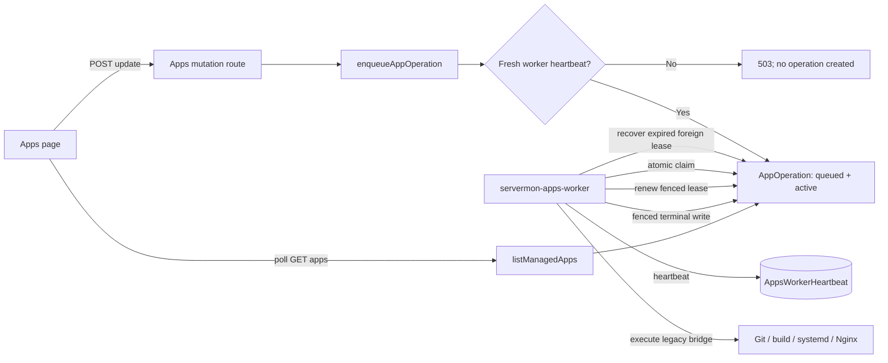

# Apps Worker Availability and Stuck Operation Recovery Design

## Goal

Fix the Apps module failure mode where an Update button remains disabled with a
spinner every time the page is opened because a durable v2 operation remains
active but no Apps worker is consuming or completing it.

This is a focused bug fix and operational hardening change. It must preserve the
current Apps page layout, asynchronous mutation API, Mongo-backed operation
queue, legacy execution bridge, app runtime configuration, and managed release
layout. It must make the queue consumer part of normal installation and upgrade,
prevent new work from being accepted when no healthy consumer exists, and
release durable operation locks after a worker crash without blindly replaying
non-checkpointed host mutations.

## Scope Classification

- **Primary type:** production bug fix.
- **Secondary type:** deployment and worker-lifecycle hardening.
- **Affected surfaces:** installer, systemd units, worker heartbeat, operation
  repository, queue runner, mutation routes, focused tests, release-contract
  checks, and deployment documentation.
- **Intentionally unaffected surface:** the visual design of the Apps cards and
  action buttons.

## Root Cause

### User-visible symptom

The app itself may be healthy and display `Running`, while the Update button
continues to show its loading indicator after page refreshes and new browser
sessions.

Those two states describe different systems:

- `Running` is the managed application's runtime state.
- the Update spinner is the persisted Apps operation state.

Refreshing the browser cannot clear a persisted queue record.

### Confirmed code path

1. `src/app/api/modules/apps/[id]/update/route.ts` no longer performs an update
   inside the HTTP request. It calls `enqueueAppOperation()` and returns `202`.
2. `enqueueAppOperation()` creates an `AppOperation` with `status: 'queued'` and
   `active: true`.
3. `src/lib/apps/service.ts:listManagedApps()` loads every
   `AppOperation` where `active: true`.
4. `mapV2StatusToLegacyStatus()` maps v2 `queued`, `running`, and
   `cancel_requested` states to the legacy UI status `running`.
5. `src/modules/apps/ui/AppsPage.tsx:appHasRunningUpdateOperation()` treats that
   mapped record as an update in progress.
6. The Update button passes that value to its `loading` prop, so the button is
   disabled and displays a spinner on every page load.

This UI behavior is internally consistent: the backend says the operation still
owns the per-app active lock.

### Primary operational defect

Commit `28c0005` added:

- `src/workers/apps-worker.ts`;
- the `pnpm apps:worker` package script; and
- `scripts/servermon-apps-worker.service` as a reference unit.

However, `scripts/install.sh` only renders, enables, starts, and verifies
`servermon.service`. It never installs or starts
`servermon-apps-worker.service`. `scripts/update-servermon.sh` delegates to
`scripts/install.sh`, so normal source and release upgrades also omit the worker.

The web process is therefore a queue producer with no deployed queue consumer.
An accepted Update remains queued and active indefinitely.

### Secondary reliability defects

The current worker foundation also contains gaps that would allow the same
symptom after a worker crash even after the service is installed:

- `renewAppOperationLease()` exists, but `src/lib/apps/worker/runner.ts` never
  calls it. A long operation therefore has an expired lease after 30 seconds.
- `finishAppOperationRecord()` does not match the lease worker and generation,
  so an obsolete worker is not fenced from a late terminal write.
- `claimNextAppOperation()` only claims queued records. No code terminally
  resolves a `running` or `cancel_requested` record whose worker died and whose
  lease expired.
- the reference service hardcodes `/usr/local/bin/pnpm` and `User=servermon`,
  while the installer already discovers the real pnpm path and may run the main
  service as root. The two services can therefore have different runtime
  assumptions.
- enqueue accepts a job without verifying that any recently heartbeating worker
  exists. A broken or disabled service can create another permanent spinner.
- worker shutdown immediately calls `process.exit(0)` after stopping the poll
  timer. It does not wait for an in-flight operation to drain, nor does it make
  repeated shutdown signals idempotent.

### Existing recovery that does not fix this record

`reconcileStaleAppUpdateOperations()` in `src/lib/apps/service.ts` only repairs
legacy update subdocuments embedded in `ManagedApp.operations`. The stuck lock
introduced by the async routes is a separate top-level `AppOperation` document.
The legacy one-hour reconciliation therefore cannot clear the v2 active index.

## Current State

### Queue producer

- File: `src/lib/apps/application/enqueue-operation.ts`.
- Validates the app and operation-specific inputs.
- Snapshots non-secret app configuration.
- Creates one active v2 operation per app through a partial unique index.
- Does not check worker readiness.

### Queue persistence

- File: `src/models/AppOperation.ts`.
- Active lock: unique `{ appId: 1, active: 1 }` with the partial predicate
  `{ active: true }`.
- Lease fields already exist: worker ID, generation, expiry, and renewal time.
- Operation deadline field already exists but is not assigned by the current
  claim flow.
- No database migration is required for the planned fix.

### Queue consumer

- Entry point: `src/workers/apps-worker.ts`.
- Poll loop: `src/lib/apps/worker/runner.ts`.
- Repository: `src/lib/apps/repositories/operation-repository.ts`.
- Execution bridge: `src/lib/apps/worker/legacy-executor.ts`.
- Worker heartbeat: `src/lib/apps/repositories/worker-heartbeat-repository.ts`.

The consumer can claim and finish a queued operation if it is manually started,
but normal installation does not start it.

### Deployment path

- `scripts/install.sh` builds or copies a release, points `/opt/servermon` at
  that release, and generates `/etc/systemd/system/servermon.service`.
- `scripts/update-servermon.sh` updates source or downloads a release artifact,
  then invokes `scripts/install.sh --use-existing-values`.
- `.github/workflows/release.yml` already includes the whole `scripts/`
  directory and application source in hub release artifacts. No packaging-list
  change is needed.
- `scripts/check-release-contract.ts` only proves that a reference worker unit
  exists. It does not prove that the installer manages that unit.

## Requirements

### Functional requirements

1. Fresh installs must install, enable, start, and verify both
   `servermon.service` and `servermon-apps-worker.service`.
2. Source upgrades and prebuilt release upgrades must manage both services and
   run the web process and Apps worker from the same stable release symlink.
3. Uninstall must stop, disable, and remove the worker service before removing
   application files and the service user.
4. The generated worker unit must use the same resolved service user, group,
   working directory, environment file, and pnpm executable as the generated web
   unit.
5. Existing queued v2 operations must be claimable automatically once the fixed
   worker starts. They must not require a browser action or direct database edit.
6. A running v2 operation abandoned by an earlier worker must become terminal
   after its lease expires, set `active: false`, and release the unique per-app
   lock.
7. Abandoned operations must be marked `failed`, not silently deleted and not
   automatically replayed.
8. New deploy, update, rollback, and delete requests must return `503` before
   creating an operation when no healthy Apps worker heartbeat exists.
9. An idempotent retry for an already-created operation must continue to return
   the existing operation even if worker readiness changed after the original
   request.
10. An active worker must periodically renew the lease of its claimed operation.
11. Lease renewal and terminal writes must be fenced by operation ID, active
    state, worker ID, and lease generation.
12. Worker shutdown must stop new claims, allow a bounded drain of current work,
    update heartbeat status best-effort, and be safe when triggered more than
    once.
13. Once an existing abandoned operation becomes terminal, the next Apps list
    poll must omit it from the active-operation overlay so the Update button is
    enabled.

### Non-functional requirements

1. Installation and upgrade remain idempotent.
2. The worker is supervised by systemd with automatic restart and process-group
   termination.
3. Worker readiness is derived from a persisted heartbeat with a bounded
   freshness window, not from an in-process Boolean in the web server.
4. Queue claim, recovery, lease renewal, and terminal transition decisions are
   atomic MongoDB writes. A read followed by an unconditional update is not
   acceptable.
5. Logs include operation ID, app ID where available, worker ID, lease
   generation, and stable failure code. They must never include environment
   values, credentials, repository tokens, or full configuration snapshots.
6. The change must not add a queue dependency such as Redis, BullMQ, or
   RabbitMQ.
7. The change must not alter managed app paths, systemd unit names, Nginx
   routing, release IDs, or app configuration schemas.
8. All project-required format, release-contract, lint, typecheck, build, and
   test commands must pass.

### Compatibility requirements

1. The existing Apps API remains asynchronous and continues returning `202` for
   accepted work.
2. Worker-unavailable responses are additive operational errors using HTTP
   `503`; authentication, validation, not-found, and active-operation conflict
   behavior remain unchanged.
3. Existing `AppOperation` documents remain readable. All new behavior uses
   fields already present in the schema.
4. Legacy embedded `ManagedApp.operations` and their one-hour update recovery
   remain in place while the legacy executor bridge exists.
5. No existing app is redeployed, restarted, rolled back, or deleted merely by
   installing this fix.

## Assumptions

- Production installs and upgrades use `scripts/install.sh` directly or use
  `scripts/update-servermon.sh`, which delegates to it.
- The production symptom corresponds to an active v2 operation in `queued` or
  `running` state. The local checkout does not contain valid credentials for the
  production MongoDB, so the exact production record was not read during this
  planning pass.
- The supported deployment target for this fix is Linux with systemd, matching
  the Apps module's current Linux-first contract.
- There is one installer-managed Apps worker per ServerMon host. Running an
  additional unmanaged `pnpm apps:worker` process in production is unsupported.
- The current legacy executor is not checkpoint-safe. Therefore an abandoned
  running operation is failed and left for an operator retry; it is never
  automatically requeued.
- A fresh heartbeat means `status === 'running'` and `lastSeenAt` is no older
  than 20 seconds. This is four times the current five-second heartbeat period
  and remains below the 30-second operation lease.
- Lease renewal runs every five seconds. This leaves multiple renewal
  opportunities within a 30-second lease.
- Graceful worker drain is bounded at 30 seconds, below the unit's 45-second
  `TimeoutStopSec`.
- The current Apps page design remains unchanged. The existing polling loop is
  sufficient to observe an operation becoming terminal and remove the spinner.
- Version-parity enforcement, checkpointed pipeline resumption, cancellation UI,
  SSE progress, and a general Apps page redesign remain separate v2 phases.

## Target Behavior

### Fresh install

1. The installer creates the release and stable `/opt/servermon` symlink.
2. It renders both systemd units using the resolved `SERVICE_USER`,
   `CONFIG_DIR`, `INSTALL_DIR`, and `PNPM_PATH`.
3. It reloads systemd once, enables both units, starts the web service, and then
   starts the worker.
4. It verifies both units are active.
5. The worker connects to MongoDB, writes a heartbeat, reconciles expired work,
   and starts polling.
6. Mutation routes only accept jobs once that heartbeat is fresh.

### Upgrade with an existing queued operation

1. The installer stops the old worker before changing the release symlink.
2. It stops the web service and switches the stable symlink.
3. It starts both services from the new release.
4. The worker sees the existing queued operation and atomically claims it.
5. The UI poll changes the operation phase from queued to running and eventually
   sees it disappear from the active overlay after a terminal result.
6. The Update button returns to its normal enabled state.

### Worker crash during an operation

1. The old worker stops heartbeating and stops renewing its operation lease.
2. systemd terminates the old worker control group and restarts the unit.
3. The new worker has a different worker ID.
4. Before claiming new work, it atomically finds an active `running` or
   `cancel_requested` operation owned by another worker whose lease has expired.
5. It sets the operation to terminal `failed`, sets `active: false`, records
   `WORKER_INTERRUPTED`, and appends a recovery event.
6. It does not rerun the operation because the legacy bridge cannot prove which
   host-side steps completed.
7. The UI unlocks the app. The operator may inspect logs and retry manually.

### Mutation request while the worker is unavailable

1. The API authenticates and validates as it does today.
2. For an idempotency-key retry, it returns the matching existing operation.
3. Before creating a new operation, the application service asks the heartbeat
   repository for worker readiness.
4. If there is no fresh running heartbeat, it throws
   `AppsWorkerUnavailableError`.
5. The route returns `503` with the stable message:
   `Apps deployment worker is unavailable; retry after the service recovers`.
6. No active operation record is created, so the UI clears its request-local
   loading state and remains usable.

## Proposed Design

### 1. Installer-managed worker service

Add an installer variable adjacent to `SERVICE_NAME`:

```bash
APPS_WORKER_SERVICE_NAME="${SERVICE_NAME}-apps-worker"
```

The generated unit must be written to:

```text
/etc/systemd/system/${APPS_WORKER_SERVICE_NAME}.service
```

Its runtime values must be rendered from the same variables as the web unit:

```ini
[Unit]
Description=ServerMon Apps deployment worker
After=network.target mongod.service
Wants=network-online.target
StartLimitIntervalSec=300
StartLimitBurst=5

[Service]
Type=simple
User=<SERVICE_USER>
Group=<SERVICE_USER>
WorkingDirectory=<INSTALL_DIR>
EnvironmentFile=<CONFIG_DIR>/env
ExecStart=<PNPM_PATH> apps:worker
Restart=always
RestartSec=5
TimeoutStopSec=45
KillMode=control-group
KillSignal=SIGTERM
FinalKillSignal=SIGKILL
StandardOutput=journal
StandardError=journal
SyslogIdentifier=servermon-apps-worker

[Install]
WantedBy=multi-user.target
```

Do not copy the reference unit verbatim during installation. It remains a
manual-install example, while the installer renders actual paths and the
selected runtime user.

Upgrade ordering:

1. Record whether each service is active for logging and recovery decisions.
2. Stop `servermon-apps-worker` first so it cannot execute host mutations while
   `/opt/servermon` changes.
3. Stop `servermon`.
4. switch the stable release symlink;
5. render both units;
6. call `systemctl daemon-reload` once;
7. enable both units;
8. start `servermon`;
9. start `servermon-apps-worker`;
10. verify both units with `systemctl is-active --quiet`;
11. only then report installation success and clean old releases.

If the web service starts but the worker does not, the installer must print the
worker-specific `systemctl status` and `journalctl` commands and exit non-zero.
The updater must therefore not report success for a deployment that can enqueue
but cannot execute Apps operations.

The installer must not delete the previous release directory when either
service verification fails. This preserves a manual rollback target even though
automatic release-symlink rollback is outside this focused fix.

Uninstall ordering:

1. stop and disable the worker;
2. stop and disable the web service;
3. remove both unit files;
4. reload systemd;
5. continue with the existing Nginx, install-directory, config, and user cleanup.

### 2. Persisted worker readiness

Extend `src/lib/apps/config.ts` with named timing constants:

```ts
export const APPS_OPERATION_LEASE_RENEW_MS = 5_000;
export const APPS_WORKER_OFFLINE_MS = 20_000;
export const APPS_WORKER_DRAIN_MS = 30_000;
```

Keep the existing poll, heartbeat, lease, deadline, and event-retention
constants. Add module-level validation proving:

- poll, heartbeat, renewal, lease, offline threshold, and drain values are
  positive;
- renewal is less than the lease;
- at least three renewal opportunities fit within one lease;
- the worker offline threshold is greater than the heartbeat interval;
- the drain duration is less than the systemd stop timeout documented by the
  unit.

The initial fix may keep these values as constants. Environment-variable parsing
is not required in this slice because the repository currently exports fixed
values and silently adding partially validated configuration would increase
risk.

Add `getAppsWorkerAvailability()` to
`src/lib/apps/repositories/worker-heartbeat-repository.ts`:

```ts
interface AppsWorkerAvailability {
  available: boolean;
  reason: 'healthy' | 'missing' | 'stale' | 'not_running';
  workerId?: string;
  lastSeenAt?: Date;
}
```

The query selects the newest heartbeat record. A worker is available only when:

- its status is `running`; and
- `lastSeenAt >= now - APPS_WORKER_OFFLINE_MS`.

Do not treat `starting`, `draining`, `stopped`, or `failed` as available. Do not
log the Mongo URI or heartbeat document wholesale.

### 3. Reject new operations without a consumer

Define `AppsWorkerUnavailableError` in
`src/lib/apps/application/enqueue-operation.ts` because worker readiness is an
application-level prerequisite for accepting new work.

The enqueue order must be:

1. connect to MongoDB;
2. if an idempotency key exists, return the matching operation if found;
3. load and validate the managed app;
4. query worker availability;
5. if unavailable, throw `AppsWorkerUnavailableError`;
6. create the queued operation.

Loading and validating the app before readiness preserves the current `App not
found`, `Only git apps can be updated`, and rollback-target errors instead of
masking invalid requests with a generic availability response.

The active-operation unique index remains the final concurrency authority. A
worker can become unavailable between the readiness query and insert; systemd
restart and durable queue persistence handle that race. The readiness query is
a fail-fast guard, not a distributed transaction.

Add a shared error-to-response helper in
`src/app/api/modules/apps/operation-route-helpers.ts` that maps:

| Error                        | HTTP status | Response                             |
| ---------------------------- | ----------: | ------------------------------------ |
| `ActiveAppOperationError`    |         409 | existing active-operation message    |
| `AppsWorkerUnavailableError` |         503 | stable worker-unavailable message    |
| unknown                      |  no mapping | route-specific existing 500 handling |

Use it in deploy, update, rollback, and delete compatibility routes. Preserve
the existing per-route logging context and do not expose stack traces.

### 4. Atomic lease renewal and fenced completion

Update repository contracts so a claimed operation carries:

- `workerId`;
- `leaseGeneration`;
- `deadlineAt`.

When claiming a queued operation, set:

- `status: 'running'`;
- `phase: 'claiming'`;
- `startedAt: now`;
- `deadlineAt: now + APPS_OPERATION_DEADLINE_MS`;
- lease worker, expiry, and renewal timestamps;
- incremented attempt and lease generation.

`renewAppOperationLease()` must match all of:

```text
operationId
active = true
status in [running, cancel_requested]
lease.workerId
lease.generation
```

`finishAppOperationRecord()` must accept `workerId` and `leaseGeneration` and
use the same fencing fields in its terminal update filter. A zero-match finish
is not success; the runner must log a lease-loss warning and must not append a
success event from the obsolete worker.

### 5. Abandoned running-operation recovery

Add `recoverExpiredAppOperationRecord()` to the operation repository. It
recovers at most one document per call so the returned record can be used to
write an ordered event.

Use one atomic `findOneAndUpdate` with these conditions:

```text
active = true
status in [running, cancel_requested]
lease.workerId != current worker ID
and one of:
  lease.expiresAt <= now
  lease.expiresAt missing and startedAt <= now - APPS_OPERATION_LEASE_MS
```

The update sets:

```text
status = failed
phase = terminal
active = false
completedAt = now
error.code = WORKER_INTERRUPTED
error.message = Apps worker stopped before operation completed
error.retryable = false
error.details.previousWorkerId = prior lease owner, when present
error.details.leaseGeneration = prior generation, when present
```

Recovery must not alter app runtime status, active release symlink, managed
release history, Nginx files, or systemd units. It only resolves durable queue
ownership. This is deliberate: the temporary legacy executor does not have
enough checkpoints to prove whether replay is safe.

After the atomic update, append an operation error event with the same stable
code and message. If event append fails, log the event failure but keep the
operation terminal; never reactivate it to repair auxiliary observability.

The runner calls recovery before every claim. It repeatedly recovers expired
records up to a small fixed batch limit, then proceeds to one queued claim. The
batch limit prevents corrupt or unexpectedly large data from starving normal
polling. A value of 25 is sufficient for this single-host queue.

The current worker ID exclusion is essential. A transient MongoDB delay must not
cause the worker's own poll loop to fail the operation it is still executing.
The runner already serializes ticks with `tickInFlight`; preserve that invariant.

### 6. Lease renewal during execution

After a successful claim, `runAppsWorkerOnce()` starts one renewal interval for
that operation. Every renewal calculates a new expiry from the current clock
and calls the fenced repository method.

Rules:

- never overlap renewal calls; skip a timer tick when a prior renewal is still
  in flight;
- clear the renewal timer in `finally` on success, failure, shutdown, or thrown
  executor error;
- a thrown transient MongoDB renewal error is logged and retried on the next
  interval;
- a successful repository call returning `false` means definite lease loss;
- after definite lease loss, do not write a terminal result from that worker;
- return or throw a typed lease-loss result so the entry point can mark its
  heartbeat failed and exit non-zero after the executor settles;
- systemd then restarts a clean worker, which terminally recovers the abandoned
  record after lease expiry.

Do not let two intervals accumulate across operations. Tests must use fake
timers or injected timer functions and must prove cleanup.

This focused fix does not add mid-command cancellation on lease loss. Host-side
execution remains serialized by the single installer-managed worker, and no new
worker may claim the active app record because recovery makes it terminal rather
than requeuing it. Abort propagation belongs to the checkpointed pipeline phase.

### 7. Worker lifecycle and shutdown

Refactor `startAppsWorkerRunner()` to expose enough lifecycle state for safe
shutdown:

```ts
interface AppsWorkerRunnerHandle {
  stopClaiming(): void;
  drain(timeoutMs: number): Promise<'drained' | 'timed_out'>;
  getCurrentOperation(): {
    operationId: string;
    leaseGeneration: number;
  } | null;
}
```

The exact internal representation may differ, but the behavior may not:

- stopping prevents new ticks and new claims;
- an in-flight operation promise remains observable;
- drain resolves immediately when idle;
- drain waits only up to `APPS_WORKER_DRAIN_MS`;
- timeout does not mark the operation succeeded or release its active lock;
- process exit leaves the record for expired-lease recovery by the restarted
  worker.

In `src/workers/apps-worker.ts`:

1. connect to MongoDB;
2. write `starting` heartbeat;
3. start the runner;
4. write `running` heartbeat;
5. heartbeat periodically with current operation metadata;
6. catch and log heartbeat write failures instead of creating unhandled promise
   rejections;
7. make shutdown idempotent with one stored shutdown promise;
8. write `draining`, stop claims, and await bounded drain;
9. mark stopped best-effort when drained;
10. exit zero after a normal signal and non-zero after a fatal lease-loss or
    startup error.

Do not call `process.exit()` until the bounded drain and heartbeat cleanup have
finished. Keep signal handlers thin and route both SIGTERM and SIGINT through the
same shutdown function.

### 8. UI behavior

No Apps page redesign is part of this fix.

The existing behavior is retained:

- accepted queued/running operations disable the relevant action;
- the page polls while an active operation exists;
- terminal v2 records have `active: false` and are no longer included by
  `listManagedApps()`' active-operation query;
- the next poll therefore enables Update.

When enqueue returns `503`, `updateApp()` already clears its local
`updatingId` in `finally` and displays the returned error. Add a regression test
to prove the button is enabled again and no polling loop is kept alive when the
server rejects before creating an operation.

Do not add local-clock unlock logic. The browser must never override a durable
backend active lock.

## Data Flow



## State Transition Contract

| Starting state     | Trigger                                   | Result                      | Active lock | Automatic replay |
| ------------------ | ----------------------------------------- | --------------------------- | ----------- | ---------------- |
| no operation       | healthy worker + valid request            | `queued`                    | acquired    | not applicable   |
| no operation       | worker missing/stale                      | no record; HTTP `503`       | free        | no               |
| `queued`           | worker claim                              | `running` + fenced lease    | held        | first execution  |
| `running`          | successful lease renewal                  | `running` + later expiry    | held        | no               |
| `running`          | executor terminal result + matching fence | terminal result             | released    | no               |
| `running`          | different worker + expired lease          | `failed/WORKER_INTERRUPTED` | released    | no               |
| `cancel_requested` | different worker + expired lease          | `failed/WORKER_INTERRUPTED` | released    | no               |
| any terminal state | late worker callback                      | no match/no mutation        | free        | no               |

Terminal states remain immutable through the existing operation-state domain
rules. The repository's atomic filters enforce the same invariant at the data
boundary.

## Files To Change

| File                                                            | Action | Detailed change                                                                                                                                                                                                                                                                     |
| --------------------------------------------------------------- | ------ | ----------------------------------------------------------------------------------------------------------------------------------------------------------------------------------------------------------------------------------------------------------------------------------- |
| `scripts/install.sh`                                            | Modify | Define the worker service name; stop it before release switching; render a worker unit from resolved installer variables; enable/start/verify both units; preserve old releases on verification failure; remove the worker unit during uninstall; print worker status/log commands. |
| `scripts/servermon-apps-worker.service`                         | Modify | Keep the manual reference template aligned with the generated unit, including restart limits, final kill signal, journal identifiers, and the documented default paths/user.                                                                                                        |
| `scripts/check-release-contract.ts`                             | Modify | Replace the shallow file-exists check with assertions that the installer renders, stops, enables, starts, verifies, and uninstalls the worker; retain bash syntax validation and package/entry-point checks.                                                                        |
| `src/lib/apps/config.ts`                                        | Modify | Add lease-renewal, worker-offline, and drain constants plus timing invariant validation.                                                                                                                                                                                            |
| `src/lib/apps/repositories/worker-heartbeat-repository.ts`      | Modify | Add newest-heartbeat readiness query and typed availability result.                                                                                                                                                                                                                 |
| `src/lib/apps/repositories/worker-heartbeat-repository.test.ts` | Add    | Cover healthy, missing, stale, non-running, and newest-record heartbeat cases.                                                                                                                                                                                                      |
| `src/lib/apps/application/enqueue-operation.ts`                 | Modify | Add `AppsWorkerUnavailableError`; check worker readiness after idempotency/app validation and before queue insertion.                                                                                                                                                               |
| `src/lib/apps/application/enqueue-operation.test.ts`            | Modify | Cover unavailable worker rejection, no inserted record, healthy worker acceptance, validation precedence, and idempotent retry precedence.                                                                                                                                          |
| `src/app/api/modules/apps/operation-route-helpers.ts`           | Modify | Add shared 409/503 operation-error mapping without changing unknown-error behavior.                                                                                                                                                                                                 |
| `src/app/api/modules/apps/[id]/deploy/route.ts`                 | Modify | Use shared operation-error mapping and return `503` for unavailable worker.                                                                                                                                                                                                         |
| `src/app/api/modules/apps/[id]/deploy/route.test.ts`            | Modify | Add worker-unavailable `503` regression coverage.                                                                                                                                                                                                                                   |
| `src/app/api/modules/apps/[id]/update/route.ts`                 | Modify | Use shared operation-error mapping and return `503` for unavailable worker.                                                                                                                                                                                                         |
| `src/app/api/modules/apps/[id]/update/route.test.ts`            | Modify | Add worker-unavailable `503` regression coverage while preserving `202`, `401`, and `409` tests.                                                                                                                                                                                    |
| `src/app/api/modules/apps/[id]/rollback/route.ts`               | Modify | Use shared operation-error mapping and return `503` for unavailable worker.                                                                                                                                                                                                         |
| `src/app/api/modules/apps/[id]/rollback/route.test.ts`          | Modify | Add worker-unavailable `503` regression coverage.                                                                                                                                                                                                                                   |
| `src/app/api/modules/apps/[id]/route.ts`                        | Modify | Use shared operation-error mapping for async delete and return `503` for unavailable worker. Preserve GET/PATCH behavior.                                                                                                                                                           |
| `src/app/api/modules/apps/[id]/route.test.ts`                   | Modify | Add worker-unavailable delete regression coverage without changing non-delete tests.                                                                                                                                                                                                |
| `src/modules/apps/types.ts`                                     | Modify | Add optional `deadlineAt` to `AcceptedAppOperation` so claimed operations carry their outer deadline through repository and runner contracts.                                                                                                                                       |
| `src/lib/apps/repositories/operation-repository.ts`             | Modify | Assign deadline during claim; fence renewal and terminal writes; add one-at-a-time atomic expired-foreign-lease recovery with stable failure metadata and event append.                                                                                                             |
| `src/lib/apps/repositories/operation-repository.test.ts`        | Modify | Cover deadline assignment, full renewal fence, full finish fence, zero-match handling, expired recovery, current-worker exclusion, missing-lease grace, terminal immutability, and event failure behavior.                                                                          |
| `src/lib/apps/worker/runner.ts`                                 | Modify | Recover expired foreign leases before claim; periodically renew a claimed lease without overlap; pass worker/generation to finish; expose stop/drain/current-operation lifecycle; surface definite lease loss.                                                                      |
| `src/lib/apps/worker/runner.test.ts`                            | Modify | Cover recovery-before-claim ordering, renewal cadence, non-overlap, timer cleanup, fenced finish arguments, lease loss, idle drain, in-flight drain, and drain timeout.                                                                                                             |
| `src/workers/apps-worker.ts`                                    | Modify | Implement starting/running/draining/stopped heartbeat lifecycle, heartbeat error handling, current-operation metadata, idempotent bounded shutdown, and fatal non-zero exit handling.                                                                                               |
| `src/workers/apps-worker.test.ts`                               | Add    | Extract or inject entry-point dependencies enough to test startup ordering, repeated signals, heartbeat failures, drained shutdown, timeout shutdown, and fatal startup without starting a real process or MongoDB.                                                                 |
| `src/modules/apps/ui/AppsPage.test.tsx`                         | Modify | Verify a worker-unavailable update error clears local loading, leaves Update enabled, and does not start active-operation polling.                                                                                                                                                  |
| `README.md`                                                     | Modify | Document the required worker service and concise status/log commands next to existing ServerMon service commands.                                                                                                                                                                   |
| `DEPLOY.md`                                                     | Modify | Document install/upgrade service ordering, worker readiness, recovery semantics, troubleshooting, and rollback actions.                                                                                                                                                             |
| `CLAUDE.md`                                                     | Modify | Update the Apps workspace index and core commands to state that host mutations require the separately supervised worker.                                                                                                                                                            |

## Files Verified But Not Changed

| File                                | Reason no change is required                                                                                                                                   |
| ----------------------------------- | -------------------------------------------------------------------------------------------------------------------------------------------------------------- |
| `scripts/update-servermon.sh`       | Both source and release paths already invoke `scripts/install.sh`; making the installer authoritative automatically fixes both upgrade modes.                  |
| `.github/workflows/release.yml`     | Hub artifacts already package `package.json`, `src`, `node_modules`, and the complete `scripts` directory, including the worker entry point and unit template. |
| `src/models/AppOperation.ts`        | Lease, deadline, active lock, result, and structured error fields already support the design.                                                                  |
| `src/models/AppsWorkerHeartbeat.ts` | Status, worker identity, last-seen time, current operation, and lease generation fields already support readiness and lifecycle reporting.                     |
| `src/lib/apps/service.ts`           | Its legacy embedded-operation recovery remains valid and separate. Active v2 records already control the button through the compatibility overlay.             |
| `src/modules/apps/ui/AppsPage.tsx`  | Existing error handling, local loading cleanup, active-operation polling, and backend-owned unlock semantics already satisfy the target behavior.              |

## Implementation Phases

### Phase 1: Lock down deployment-service behavior with failing contract checks

Dependencies: none.

1. Extend `checkAppsWorkerContract()` in
   `scripts/check-release-contract.ts` with failing assertions for every
   installer lifecycle action listed in the Files To Change table.
2. Assert the worker unit uses installer variables rather than a hardcoded user
   or pnpm path.
3. Assert uninstall removes the worker unit.
4. Assert worker verification occurs before old-release cleanup.
5. Run `pnpm check:release-contract` and confirm it fails against the current
   installer.

Exit criteria:

- the release contract reliably detects the current root cause;
- `bash -n scripts/install.sh` and `bash -n scripts/update-servermon.sh` remain
  part of the contract.

### Phase 2: Make the worker a first-class installed service

Dependencies: Phase 1.

1. Add `APPS_WORKER_SERVICE_NAME` to `scripts/install.sh`.
2. Extend uninstall cleanup first so partial implementation is still removable.
3. Stop the existing worker before stopping the web service and changing the
   stable release symlink.
4. Render the worker unit next to the web unit using the same resolved values.
5. Enable and start both services.
6. Verify both services before cleanup and final success output.
7. Keep the previous release when either verification fails and exit non-zero.
8. Align the reference unit.
9. Re-run `pnpm check:release-contract` and `bash -n scripts/install.sh` until
   green.

Exit criteria:

- fresh install, source upgrade, and release upgrade all manage both services;
- the worker and web process resolve `/opt/servermon` to the same release;
- an inactive worker makes installation fail loudly.

### Phase 3: Add worker readiness and fail-fast enqueue

Dependencies: Phase 2 for safe production rollout; tests may be authored before
deployment edits finish.

1. Add timing constants and invariant validation in `config.ts`.
2. Write failing heartbeat-repository tests.
3. Implement `getAppsWorkerAvailability()`.
4. Write failing enqueue tests for healthy, stale, missing, and non-running
   workers, plus validation and idempotency precedence.
5. Implement `AppsWorkerUnavailableError` and the readiness gate.
6. Write failing route tests for `503` across deploy, update, rollback, and
   delete.
7. Add shared route error mapping and update all four routes.
8. Run the heartbeat, enqueue, and route test files together.

Exit criteria:

- the API cannot create new permanent queued records while the consumer is
  known to be unavailable;
- the existing `202`, `409`, validation, and authentication contracts remain
  intact.

### Phase 4: Add lease fencing and expired-operation recovery

Dependencies: Phase 3 timing constants.

1. Write failing repository tests for claim deadline, renewal fence, terminal
   fence, and expired foreign-worker recovery.
2. Add `deadlineAt` mapping to accepted/claimed operation DTOs.
3. Add deadline assignment to the atomic claim.
4. Strengthen renewal and finish filters.
5. Implement one-record atomic recovery and stable failure details.
6. Append a recovery error event after terminalization.
7. Ensure event failure cannot reactivate the operation.
8. Run repository, model, event-repository, and domain-state tests together.

Exit criteria:

- a late worker cannot finish an operation after ownership changes;
- an abandoned operation releases its active lock without being replayed;
- terminal state remains immutable.

### Phase 5: Renew leases and support bounded drain

Dependencies: Phase 4 repository API.

1. Write runner tests using fake timers or injected clock/timer functions.
2. Run recovery before claim.
3. Start one non-overlapping renewal loop per claimed operation.
4. Pass worker ID and generation into finish.
5. Surface definite lease loss without writing a terminal result.
6. Track the current in-flight promise and operation metadata.
7. Add stop-claiming and bounded-drain behavior.
8. Refactor the process entry point behind injected dependencies or an exported
   `runAppsWorkerProcess()` function so lifecycle behavior can be tested without
   importing an auto-starting process.
9. Implement robust heartbeat and signal handling.
10. Run worker runner, entry-point, heartbeat, and repository tests together.

Exit criteria:

- long operations keep a valid lease;
- shutdown never claims new work;
- a dead worker is recoverable after lease expiry;
- no interval or unhandled promise rejection survives shutdown in tests.

### Phase 6: Add the UI regression test and operational documentation

Dependencies: Phases 2 through 5.

1. Add the Apps page `503` regression case without changing production UI code.
2. Update README service commands.
3. Add DEPLOY troubleshooting and rollback instructions.
4. Update the Apps index in CLAUDE.md.
5. Run Prettier on the changed Markdown and TypeScript files.

Exit criteria:

- the reported button symptom is covered at UI, API, queue, worker, and
  installer boundaries;
- operators have exact commands for diagnosing worker health.

### Phase 7: Full verification and deployment rehearsal

Dependencies: all earlier phases.

1. Run focused tests listed in the Testing Plan.
2. Run all mandatory repository checks.
3. On a disposable supported Linux host, rehearse fresh install.
4. Enqueue an update and verify it leaves queued state.
5. Stop the worker during a controlled test operation, wait for lease expiry,
   start the worker, and verify terminal recovery and UI unlock.
6. Stop the worker, wait beyond the heartbeat threshold, attempt an update, and
   verify `503` with no new active operation.
7. Re-run the installer with `--use-existing-values` and verify both units run
   the same release target.
8. Rehearse uninstall and confirm both unit files are removed.

Exit criteria:

- automated checks pass;
- the original production failure mode is reproduced before the fix or by a
  fixture and is absent after the fix;
- deployment and rollback commands are verified on systemd rather than inferred
  only from unit tests.

## Testing Plan

### Automated tests

| Test category              | File or command                                                                        | Purpose                                                                                      |
| -------------------------- | -------------------------------------------------------------------------------------- | -------------------------------------------------------------------------------------------- |
| Release contract RED/GREEN | `pnpm check:release-contract`                                                          | Prove the installer manages the worker across install, upgrade, verification, and uninstall. |
| Bash syntax                | `bash -n scripts/install.sh && bash -n scripts/update-servermon.sh`                    | Prevent shell syntax regressions.                                                            |
| Heartbeat repository       | `pnpm vitest run src/lib/apps/repositories/worker-heartbeat-repository.test.ts`        | Verify fresh/stale/missing/status readiness rules.                                           |
| Enqueue application        | `pnpm vitest run src/lib/apps/application/enqueue-operation.test.ts`                   | Verify fail-fast `503` prerequisite without breaking validation or idempotency.              |
| Mutation routes            | `pnpm vitest run 'src/app/api/modules/apps/**/*.test.ts'` or explicit route test paths | Verify auth, accepted, conflict, and worker-unavailable contracts.                           |
| Operation repository       | `pnpm vitest run src/lib/apps/repositories/operation-repository.test.ts`               | Verify atomic claim, lease, fencing, and recovery filters.                                   |
| Event repository           | `pnpm vitest run src/lib/apps/repositories/operation-event-repository.test.ts`         | Verify recovery event sequencing and redaction remain correct.                               |
| Worker runner              | `pnpm vitest run src/lib/apps/worker/runner.test.ts`                                   | Verify recovery ordering, renewals, lease loss, and drain behavior.                          |
| Worker entry point         | `pnpm vitest run src/workers/apps-worker.test.ts`                                      | Verify heartbeat lifecycle, signal idempotency, and exit behavior.                           |
| Apps service mapping       | `pnpm vitest run src/lib/apps/service.test.ts`                                         | Preserve active-v2-to-legacy UI compatibility mapping.                                       |
| Apps UI regression         | `pnpm vitest run src/modules/apps/ui/AppsPage.test.tsx`                                | Verify `503` clears loading and terminal recovery enables Update.                            |
| Model invariants           | `pnpm vitest run src/models/AppOperation.test.ts`                                      | Preserve active-lock and lease indexes.                                                      |

### Required repository checks

Run from `/Users/manthanby/mby_repos/ServerMon`:

```bash
pnpm format:check
pnpm check:release-contract
pnpm lint
pnpm typecheck
pnpm build
pnpm test
```

`pnpm check` may run the release contract, lint, typecheck, build, and full test
suite in sequence, but `pnpm format:check` remains separate and mandatory.

### Manual systemd acceptance matrix

| Scenario                          | Procedure                                                               | Expected result                                                                             |
| --------------------------------- | ----------------------------------------------------------------------- | ------------------------------------------------------------------------------------------- |
| Fresh install                     | Install on clean Ubuntu/Debian host                                     | Both units enabled and active; fresh worker heartbeat appears.                              |
| Upgrade from `28c0005`            | Leave a queued update, then run fixed installer                         | Worker starts, claims existing queue record, operation terminates, Update unlocks.          |
| Worker unavailable before enqueue | Stop worker and wait over 20 seconds                                    | Mutation returns `503`; no `active: true` record is created.                                |
| Worker restart while idle         | Restart worker unit                                                     | New heartbeat appears; no app runtime changes.                                              |
| Worker killed during operation    | Kill worker control group, allow systemd restart, wait for lease expiry | Old operation becomes `failed/WORKER_INTERRUPTED`, active lock clears, no automatic replay. |
| Long operation                    | Use a controlled executor longer than 30 seconds                        | Lease expiry keeps advancing every five seconds.                                            |
| Web restart during operation      | Restart only `servermon`                                                | Worker continues; operation completes; refreshed page shows current persisted state.        |
| Full ServerMon upgrade            | Run `update-servermon.sh`                                               | Worker stops before symlink switch and both services restart from the same target.          |
| Uninstall                         | Run installer with `--uninstall`                                        | Both units stopped, disabled, and removed; daemon reloaded.                                 |

## Edge Cases

### Existing queued operation from the broken deployment

Do not mark it failed merely because it is old. Once the fixed service starts,
it has not executed any host mutation and is safe to claim normally.

### Existing running operation with an unexpired old lease

The new worker waits until the lease expires. It must not guess that the old
worker is dead before the durable ownership window closes.

### Existing running operation without a lease expiry

Treat it as abandoned only when its `startedAt` is at least one lease duration
old and it is not owned by the current worker. This supports early foundation
records without immediately failing a newly claimed record during rollout.

### Worker heartbeat exists but is stale

Readiness returns unavailable even if the stored status still says `running`.
Status alone is insufficient after an ungraceful process death.

### Multiple historical heartbeat rows

Use the newest `lastSeenAt`. A stale record from an old worker must not mask a
new healthy worker, and a stopped recent worker must not be considered healthy.

### Worker restarts inside the readiness race

A request may receive `503` milliseconds before systemd restores the worker.
This is acceptable and safe; the user can retry. Creating a durable lock without
a known consumer is worse.

### Worker dies immediately after operation creation

The operation remains queued. systemd restarts the worker, which safely claims
queued work because no host execution began. The readiness check cannot remove
this race and is not intended to.

### Worker dies after host mutation begins

The operation is failed after lease expiry and is not replayed. The operator may
need to inspect the app's current symlink, runtime service, and Nginx state
before retrying. This is safer than duplicating an uncertain deploy, rollback,
or delete.

### MongoDB temporarily unavailable during lease renewal

Log the error and retry the next renewal. Do not mark success and do not spawn a
second renewal call. Since the installer manages one worker, no local concurrent
consumer is introduced. If ownership is actually lost, the first zero-match
renewal or terminal write activates lease-loss handling.

### Event append fails after recovery

Keep the queue record terminal and log the event failure. The active lock is a
correctness boundary; the event is observability.

### Installer is configured with `--allow-root`

Render both units with `User=root` and `Group=root`. Do not leave the worker on
the reference template's `servermon` user.

### pnpm is not installed at `/usr/local/bin/pnpm`

Use the installer's `PNPM_PATH` for both generated units. The reference unit may
show `/usr/local/bin/pnpm` as a documented default only.

### Remote MongoDB with `--skip-mongo`

Do not add a hard `Requires=mongod.service`. Keep network ordering and the same
conditional/local Mongo behavior as the main unit. The worker's `Restart=always`
handles transient remote database availability.

### Shutdown receives SIGTERM and SIGINT

Both signals must share one shutdown promise. The second signal must not create
a second drain timer, duplicate heartbeat writes, or call `process.exit()`
twice.

### Operation finishes while shutdown begins

The in-flight promise may finish and write its fenced terminal state. Drain then
resolves as completed, heartbeat becomes stopped, and the process exits normally.

### Operation exceeds drain timeout

Leave the operation active. Exit and let systemd terminate the process group.
The restarted worker fails the old operation only after its lease expires. Do
not set `active: false` before the old process is gone.

### UI page is opened while recovery occurs

One poll may still show the spinner. The next successful list response after
terminal recovery omits the inactive v2 operation and enables Update. No local
state override is necessary.

## Error Codes and Messages

| Code or error type           | Stable message                                                            | Retryable             | Surface                                                     |
| ---------------------------- | ------------------------------------------------------------------------- | --------------------- | ----------------------------------------------------------- |
| `AppsWorkerUnavailableError` | `Apps deployment worker is unavailable; retry after the service recovers` | yes, by a new request | HTTP `503`, no operation record                             |
| `WORKER_INTERRUPTED`         | `Apps worker stopped before operation completed`                          | false automatically   | terminal `AppOperation.error` and event                     |
| `AppOperationLeaseLostError` | `Apps worker lost operation lease ownership`                              | false automatically   | local worker log/heartbeat failure; no stale terminal write |

Do not reuse the legacy `Update timed out after 1 hour` message for worker loss.
Timeout and process interruption are different operator actions and must remain
distinguishable.

## Logging and Observability

Required structured log events:

- worker startup: worker ID, hostname, version;
- readiness rejection: operation type and app ID, without app configuration;
- claim: operation ID, app ID, worker ID, generation, deadline;
- lease renewal failure: operation ID, worker ID, generation, error category;
- expired recovery: operation ID, previous worker ID, previous generation;
- fenced finish zero-match: operation ID, worker ID, generation;
- shutdown start/end: worker ID, current operation ID, drain result;
- installer failure: exact failed unit name and diagnostic commands.

Recommended operator commands:

```bash
sudo systemctl status servermon servermon-apps-worker --no-pager
sudo systemctl is-enabled servermon-apps-worker
sudo journalctl -u servermon-apps-worker -n 200 --no-pager
sudo systemctl restart servermon-apps-worker
```

The worker heartbeat collection is diagnostic metadata, not an authorization
source. API authentication remains the existing admin-session check.

## Security Considerations

- The worker must run as the same OS user selected for ServerMon so the fix does
  not silently broaden privileges.
- The environment file remains `/etc/servermon/env` with existing installer
  permissions; no secrets are copied into `AppOperation` or heartbeat records.
- Readiness and recovery logs must not serialize config snapshots.
- Recovery never invokes shell commands and never trusts user-controlled paths.
- Existing command and path validation remain unchanged.
- HTTP `503` responses expose only a stable operational message, not systemd,
  process, path, MongoDB, or stack-trace details.

## Performance Considerations

- Heartbeat readiness adds one indexed newest-record query per new mutation,
  not per Apps list poll.
- The `lastSeenAt` descending index already supports the readiness query.
- Expired recovery uses the existing lease-expiry index and processes a bounded
  batch before one queue claim.
- Lease renewal adds one small indexed update every five seconds only while an
  operation is executing.
- The Apps page polling behavior and list query frequency remain unchanged.

## Risks And Mitigations

### Risk: installer reports success while the worker is crash-looping

Mitigation: verify `systemctl is-active` for both services and exit non-zero on
worker failure. Strengthen the release contract so omitting verification is a
test failure.

### Risk: automatic recovery repeats a partially applied host mutation

Mitigation: never requeue a running legacy-bridge operation. Mark it failed and
require manual retry after inspection.

### Risk: old worker writes success after a new owner/recovery decision

Mitigation: fence renewal and finish by worker ID and lease generation; terminal
recovery sets `active: false` atomically.

### Risk: heartbeat false-negative during restart

Mitigation: return `503` without mutation. A short-lived false-negative is safe
and retryable; it does not create a durable lock.

### Risk: upgrade changes the release symlink while the worker is active

Mitigation: stop the worker before the web service and before symlink switching;
start both from the new stable target.

### Risk: event append failure hides recovery details

Mitigation: keep structured error details on the terminal operation itself and
log the event failure. Event persistence cannot block lock release.

### Risk: an unmanaged second worker is started manually

Mitigation: document one installer-managed production worker. Full filesystem
singleton locking remains part of the later checkpointed-worker phase; the
atomic lease and active-app index still prevent two workers from claiming the
same queued record.

### Risk: current operation does not finish inside shutdown drain

Mitigation: systemd kills the worker control group after `TimeoutStopSec`; the
new worker waits for lease expiry and records interruption without replay.

### Risk: route error handling diverges across four compatibility endpoints

Mitigation: centralize typed 409/503 mapping in
`operation-route-helpers.ts` and keep route-specific unknown-error logging.

## Rollout

### Pre-deployment

1. Run all automated checks.
2. Confirm the release artifact still contains:
   - `package.json` with `apps:worker`;
   - `src/workers/apps-worker.ts`;
   - production `tsx` dependency;
   - `scripts/install.sh`;
   - `scripts/servermon-apps-worker.service`.
3. Record the current `/opt/servermon` symlink target.
4. Record current web service status.
5. If production access is available, record active v2 operations by operation
   ID and status without printing config snapshots.

### Deployment

Deploy through the normal fixed installer/update path. Do not manually clear the
operation before the worker has had an opportunity to consume a safely queued
record.

Expected sequence:

1. fixed installer stops any existing worker;
2. release symlink advances;
3. both units are generated and started;
4. worker heartbeat becomes fresh;
5. existing queued work is claimed;
6. expired running work is terminally failed after lease expiry;
7. Apps polling enables Update after terminalization.

### Post-deployment verification

```bash
sudo systemctl is-active servermon
sudo systemctl is-active servermon-apps-worker
sudo systemctl is-enabled servermon-apps-worker
sudo journalctl -u servermon-apps-worker -n 100 --no-pager
```

Then verify from the Apps page:

1. no app shows a permanent spinner without a corresponding active worker job;
2. a new Update moves from queued to running and then to a terminal result;
3. refreshing the page preserves real progress;
4. stopping the worker produces an actionable error for a new request after the
   heartbeat freshness window.

## Rollback

### Roll back only this fix while retaining async Apps operations

Do not disable the worker. Commit `28c0005` already routes mutations through the
queue, so the worker service is required even if application code is rolled back
to that foundation. Keep the generated unit enabled and ensure it points at the
rolled-back `/opt/servermon` release.

The code rollback removes fail-fast readiness and recovery improvements but does
not require a schema rollback because no new fields are added.

### Roll back below the async worker foundation

1. stop and disable `servermon-apps-worker`;
2. roll `/opt/servermon` back to a release before `28c0005`;
3. restart `servermon`;
4. preserve v2 operation documents for later inspection;
5. do not delete or mass-edit v2 records during rollback;
6. recognize that pre-v2 code ignores those records and returns to synchronous
   compatibility routes.

### Emergency mitigation if the worker cannot start

1. leave the managed app runtime untouched;
2. inspect the worker journal and correct service user, pnpm path, environment,
   or MongoDB access;
3. restart the worker;
4. allow queued operations to be consumed;
5. allow expired running operations to be marked interrupted;
6. avoid direct `active: false` database edits unless a separate operator
   runbook proves the owning process is gone and records the intervention.

## Non-Goals

- Redesigning Apps cards, buttons, dialogs, or summary widgets.
- Treating the app's `Running` runtime badge as proof that no operation is
  active.
- Replacing the Mongo-backed queue.
- Implementing the full checkpointed deploy/update/rollback/delete pipelines.
- Automatically retrying or resuming a partially executed legacy operation.
- Adding user-facing cancellation controls.
- Moving Git auto-update scheduling from the web process into the worker.
- Migrating legacy embedded operation or release history.
- Removing legacy Apps service functions or compatibility DTO mapping.
- Adding per-app concurrency or multiple worker slots.
- Enforcing web/worker build-version parity in the API.
- Adding a new UI worker-health panel.
- Adding a production filesystem singleton lock in this focused repair. Normal
  production operation remains one installer-managed systemd service.

## Acceptance Criteria

- [ ] A default fresh install leaves `servermon` and
      `servermon-apps-worker` enabled and active.
- [ ] `--allow-root` renders both services as root; default mode renders both as
      the selected non-root service user.
- [ ] Source and release upgrades restart both services against the same
      `/opt/servermon` target.
- [ ] Uninstall removes both systemd units.
- [ ] The release contract fails if any worker install/start/verify/uninstall
      lifecycle action is removed.
- [ ] A fresh healthy heartbeat allows enqueue and returns `202`.
- [ ] A missing, stale, draining, stopped, or failed heartbeat returns `503`
      before operation creation.
- [ ] An idempotent retry can return its existing operation independently of
      current readiness.
- [ ] A claimed operation receives a deadline and renews its lease every five
      seconds without overlapping renewals.
- [ ] Lease renewal and finish are fenced by worker ID and generation.
- [ ] A different worker atomically fails an expired running operation with
      `WORKER_INTERRUPTED` and `active: false`.
- [ ] The current worker never recovers its own in-flight record.
- [ ] Recovery never requeues or re-executes a running legacy-bridge operation.
- [ ] A failed event append cannot leave the active lock held.
- [ ] Graceful shutdown is idempotent and bounded.
- [ ] The Apps page clears request-local loading after `503`.
- [ ] The Apps page enables Update after backend terminal recovery removes the
      active overlay.
- [ ] No production UI layout changes are required.
- [ ] All required repository checks pass.
- [ ] A systemd deployment rehearsal proves the original failure mode is fixed.

## Implementer Guardrails

1. Write each failing test before its implementation change.
2. Do not modify the Apps UI appearance to hide a backend lock.
3. Do not delete stuck operation records.
4. Do not set `active: false` until the terminal failure/result is written in
   the same atomic update.
5. Do not recover an unexpired lease.
6. Do not recover an operation owned by the current worker.
7. Do not automatically requeue a running operation executed through the
   legacy bridge.
8. Do not weaken the partial unique active-operation index.
9. Do not make lease renewals read-then-write.
10. Do not treat a heartbeat status as healthy without checking freshness.
11. Do not check readiness before returning an existing idempotent operation.
12. Do not hardcode the generated unit's user or pnpm path.
13. Do not let the updater bypass the installer as the service-lifecycle source
    of truth.
14. Do not log environment values, config snapshots, session data, or MongoDB
    connection strings.
15. Do not add dependencies for timers, queueing, retries, or service rendering.
16. Do not claim completion from mocked tests alone; perform the systemd
    rehearsal.

## Implementer Handoff Checklist

- [x] Root cause is stated and tied to current code paths.
- [x] Material assumptions are explicit.
- [x] Target behavior is defined for install, upgrade, enqueue, crash recovery,
      and shutdown.
- [x] Every expected file addition and modification is named.
- [x] Files intentionally verified without changes are named.
- [x] Implementation phases are ordered with dependencies and exit criteria.
- [x] Unit, integration, UI, release-contract, and manual systemd tests are
      listed.
- [x] Edge cases, security, performance, observability, rollout, and rollback
      are covered.
- [x] The plan avoids broad Apps UI or pipeline redesign.
- [x] No unresolved decision is left for the implementer.
